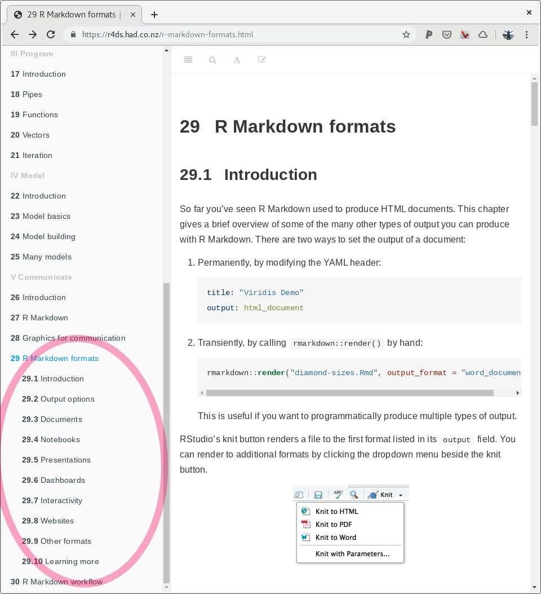

# Introduction to Rmarkdown

Work towards remote repository becomes your "cannonical" location for the project and gives you nice workflow with your supervisor

Rmarkdown has become much more then just embedding R code into a document. For me it has essentially become the status quo of doing research. These days Rmarkdown document goes without saying with any analysis I do. The Rmarkdown incepts the right practices of doing analysis; it makes you write things down, to explain to yourself and others what you did, it makes your analysis open, anyone can see exactly what you've done and it makes your analysis reproducible since you'll be able to re-run that code to get those same tables and figures again and again. The ultimate goal for any projects, be that honours, PhD or any other analytical work, to be logged and shared via Rmarkdown with peers and supervisor(s). Depending on the aspects of the work, sharing should be done via remote repositories, for example github or gitlab two popular resources.

Rmarkdown is a natural evolution of vanilla markdown, backed by R package `knitr` and an external tool `pandoc`. Markdown is a powerful language for writing plain text documents that are easily parsed and/or converted to other more sophisticated document types, for example **PDF** or **HTML** to name a couple.

There are other plain text languages alike markdown that have the same goal of simplify documents writing and with means of light text tagging or marking up ability to indicate important parts of the text such as titles, paragraphs and code blocks. The underlying idea for then markdown is that it is easy-to-write and easy-to-read. In this workshop we will be mainly focusing on Rmarkdown flavour, although it has really diverged into it's own language essentially now. And although you can use any [text editor](https://en.wikipedia.org/wiki/Text_editor) to write your markdown, we'll be using [RStudio](https://rstudio.com) for all of our work.

## Rmarkdown document parts

Any Rmarkdown documents is broken into three main parts:

- [YAML header](#yaml-header-intro)
- [The R chunks](#the-r-chunks)
- [markdown - plain text](#vanilla-markdown)

Those are different parts of the document that all work together to form - render a final document. Each one of those parts can be customised with further options, which will cover later in the book. One thing to note is that Rmarkdown is multi-component ecosystem, for example [YAML](https://en.wikipedia.org/wiki/YAML) is a stand alone language and can be used outside of Rmarkdown context. For example [ansible configuration management software](https://en.wikipedia.org/wiki/Ansible_(software)) uses YAMl as internal definition language. In Rmarkdown case we are using YAML header to pass additional information about type and apperance of the final document, but more on that later.

### [YAML header section](#yaml-header-intro)

YAML header will always seat at the very top of your Rmarkdown document and it starts and ends with triple dash symbols, `---`. Note that YAML is indentation and space sensitive, meaning you need to be rather strict about amount of indentation you use and text strings will need to be quoted.

```
 ---
 title: "Hello world"
 author: "Kirill"
 date: "17 June 2019"
 output: html_document
 ---
```

### [The R chunks](#the-r-chunks)


````
```{r}
plot(mtcars)
```
````

### [Everything else is plain old markdown](#vanilla-markdown)

```
 # Have I been Marked Down?
```

## Challenge: Rmarkdown 101 {.exercise}

> 5 minutes

<details>

  <summary>
    1. What file extention should we typically use for saving our <u>**Rm**</u>ark<u>**d**</u>own files?
  </summary>
  [answer link](https://superuser.com/questions/249436/file-extension-for-markdown-files)

</details>


<details>

  <summary>
    2. What document types can be produced (compiled) from Rmarkdown?
  </summary>

  <a href="https://r4ds.had.co.nz/r-markdown-formats.html">
    
  </a>

</details>

<details>
  <summary>
    3. Will I have to learn more "languges" to use Rmarkdown (discussion question)?
  </summary>

  The short answer is no. Learning and writing Rmarkdown will take you a very long way.

  The longer answer is yes. At some point in the future you might want to very sophisticated documents and for that you'll most certainly will need at least tiny amount of html + css knowledge and maybe some knowledge about LaTeX (I've yet to learn a single thing about LaTeX - so far so good :D )

  [check out this bit of Rmarkdown](link to github that the line of code above)

</details>

## Useful to know

> One cannot know all of Rmarkdown wisdom. One would continuesly learn to make oneself more Rsome.
> --- Kirill Tsyganov (2019)

- don't attempt to compile to `pdf_document` until absolutelly necesserary. `LaTeX` engine that is used for Rmarkdown to pdf conversion known to have issues with aligning figures and tables. This typically causes figures and tables overflow to next pages and general text misalignment. Get your content written first, intermidiate compilation to `html_documents` are totaly fine, before worrying about technical issues

