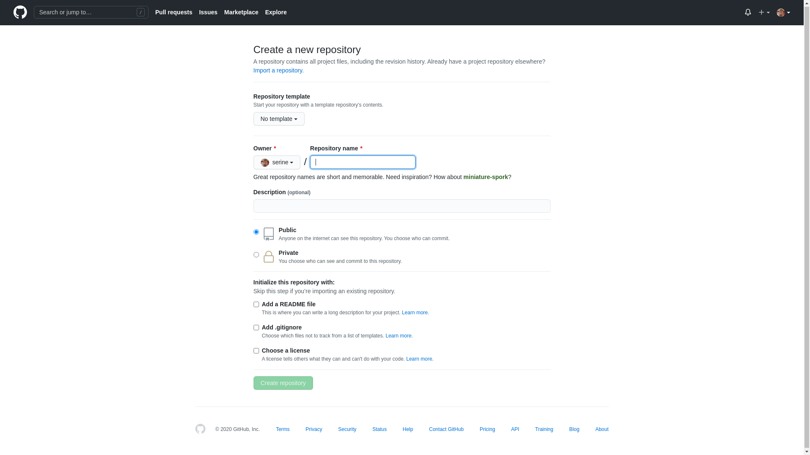
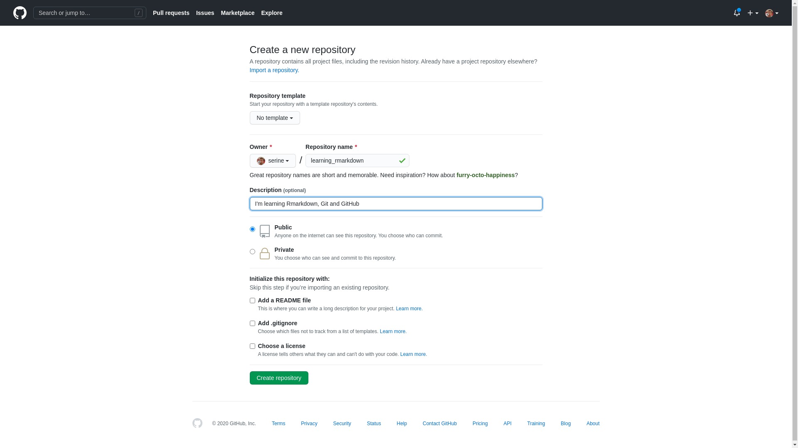
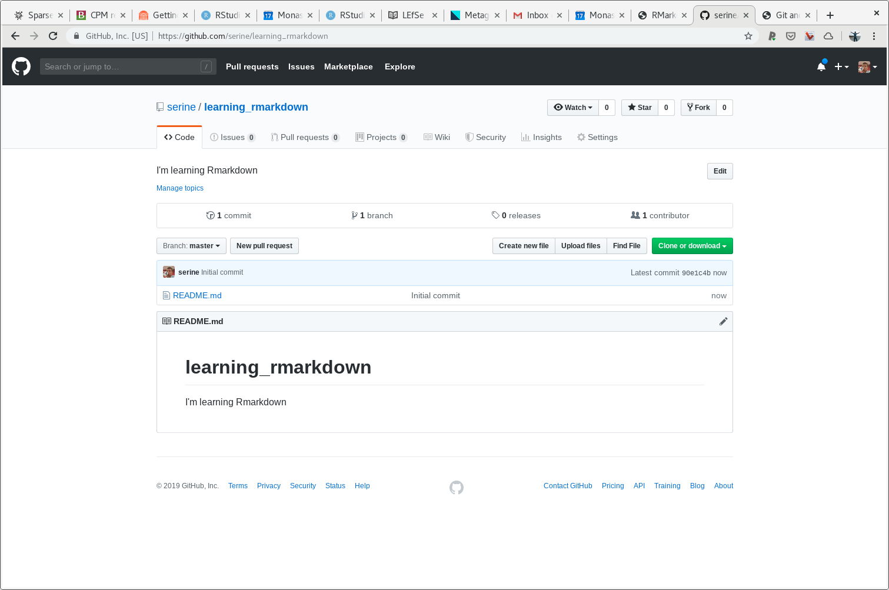
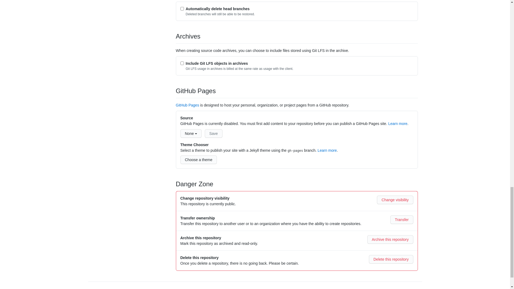
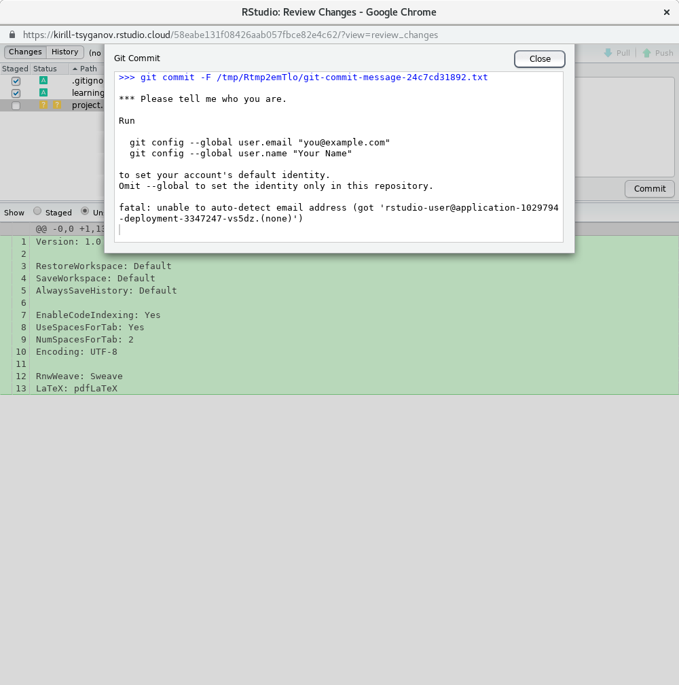
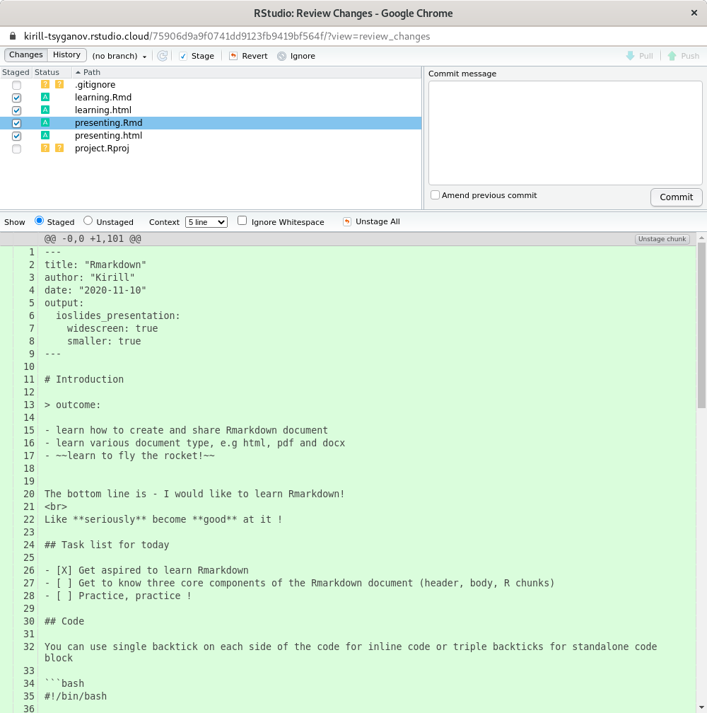
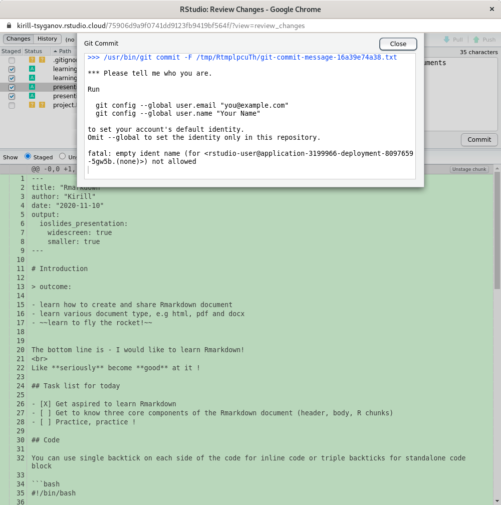

# (PART) Part {-}

# Git and GitHub introduction

> When you are rock climbing you want to set your anchors often
> How often will depend on your experience and desire not to fall
> Git commit like you are vertically hanging off 70 feet rock

I going to break to you right at the start that (unfortunatelly) doing git and GitHub is like rock climbing, but nonetheless it has great benefits for your research and analysis including making it more visiable, reproducible and potentially collaborative.

[Git](https://git-scm.com/doc) is one of many tool, but very popular, that was design for **tracking versions** of software development - a.k.a version control tool. While it hasn't been strickly design with scientific research projects in mind we will happily repurpose git to help us stay on top of our research projects. In git world everything rotates around git repository, which is "special" folder. Inside that folder every file and folder is "tracked" for changes. Git repositories often are synonymous with project folder. It is a "bucket" or "container" that holds everything related to a particular project.

<div class="figure" style="text-align: left">

<p class="caption">(\#fig:unnamed-chunk-1)This is an example of git version cotrol vs DIY versioning via filesystem</p>
</div>

GitHub on the another hand is a place where people can deposit, store and share their git repositories. GitHub also one of many different places that people can choose to use to store and share their git repositories. Image below illustrates some of other common place one can choose to store they git repositories a.k.a projects

<div class="figure" style="text-align: left">

<p class="caption">(\#fig:unnamed-chunk-2)https://www.geekboots.com/story/what-is-the-difference-between-bitbucket-github-and-gitlab</p>
</div>

For this workshop we are going to go with GitHub, mainly it is very popular and it has a lot of useful features, some of which I'll share with you later in the workshop.

Git and GitHub will help you:

- organise our directory structure
- create "milestones" a.k.a `git commits`
- make apparent which parts of the projects (files) are important
- share your work (e.g GitHub)
- collaborate at the global scale

## Github setup

There are a couple of different ways you start a project and initiate git repository - git tracking.
We are going to start with GitHub first approach. An alternative approach discussed in [appendix section D](#d). I hope that everyone had already created [GitHub](https://github.com/) account. We are going to create a new github repository, which is also automatically a git repository. Remember that GitHub is just a place where we are storing out git repositories and you can only store git repositories on GitHub.

Let's go to [GitHub](https://github.com/) and create new repository and let's name it "learning_rmarkdown".



Description of the repository is optional, but a good idea to write a brief sentence there to message to yourself and the public what this project is about. Let's write the following brief sentence; "I'm learning Rmarkdown". Also note that I ticked "Initialize this repository with a README". This completely optional.



This is the screen you are going to get when you've initialised it with a README file



And this is a screen you are going to get if you haven't initialised it with a README file


A brief note about README files. It is regarded as a "silent" way of communication, where you can tell all necessary information another person need to know about your project. For a software tool you would put information about how to build that particular tool and dependencies. In our case we will add information how to build final html report. We will do this a bit later in the workshop.

Either way is completely fine! Once we have our GitHub repository we need to find a link (URL) and copy a.k.a **clone** (git clone) our repository to our working computer, in our case [rstudio.cloud](https://rstudio.cloud). We want to establish connection between [rstudio.cloud](https://rstudio.cloud) and GitHub such that we can with little effort we can copy our work, that is file from [rstudio.cloud](https://rstudio.cloud) to GitHub.

This is how typical URL looks like

```
https://github.com/serine/learing_rmarkdown.git
```

There are at least three components in that url

- `https://github.com/` the place i.e the name of the website
- `serine/` username
- `learing_rmarkdown.git` repository name (project name)

You can get this url, but either looking at the address bar of your browser or there is a little drop down menu on the right hand site.



## RStudio setup

Add description about starting a project from a github at RStudio.

## GitHub things

- PR (pull request)
- gitissues place to talk about issues related to a project
- stars acknowledgement
- watch interested in updates on a projects

<!--
TODO in future need to make an annotated images to all those buttons
-->

collaborators and update dates/commits as a proxy of how active the project is. also do check which files typically being changed. Also mention the fact that it is very explicit when the project was started (initiated) how much work has gone into it (commits history) and roughly time frame and intervals of work

in simple workflow and collaborations git merge will work just fine. git will happily merge two different branches i.e all files in one location with all files in the other location if no two file conflict


## More git

Git is a command line tool however you don't have to learn command line just yet. There are a [few git clients available](https://happygitwithr.com/git-client.html) - graphical user interface (GUI) tool / applications that we can use instead of learning command line. We are going to use RStudio which has good git support and therefore Rstudio will be our git client. One rather important note about git clients, most (all) clients will "simply" form a git commands as you would type it out and execute on command line. This means a couple of things:

1. one can use mixture of clients and command line without any issues. For example if one needs more complicated git command one could run it on the command-line.
2. if you need to do a more complicated git kung fu you might only find solution for command line and then it'll be up to you to figure out how to work it into your client

An interesting note about command line git usage noted in [Happy Git with R book](https://happygitwithr.com/git-client.html); One might think that git via cli is "better", however it is more important to get the work done and have it version controlled rather then fight with the cli. Do take the simplest and quickest path to get your work version controlled. No one will care which client you are using in the end.

## git no nos

- no spaces in file names (this goes beyond git)
- no git repositories inside an existing git repository

## Starting with git

In Rstudio you can only start working with git when you have an existing Rproject directory


### Configuring git

You will most certainly forget this step, because you only need to do it once per computer (or new installation of git). Git will remind if you haven't done these steps.
These are our very first step in being organise and ready for future collaboration. We need to let git know our name and email address, which will get stored in configuration file.

Unfortunately RStudio doesn't have support for setting up config. It was probably not worth implementing given that you only really do it once. We will have to use terminal (command line) just this once.

Let's open up a terminal and run a couple of `git` commands

Tools -> Terminal -> New Terminal

```
git config --global user.name kirill
git config --global user.name "kirill.tsyganov@monash.edu"
```

One can then double check that all was set correctly bu running this command.

```
git config --global --list
```



### Intiating git repository

In git jargon repository is simply your working folder (folders sometimes also called directories). In our case

`Rproject folder == Rproject directory == git repository == git repo`

Let's initate git repository

Tools -> Version Control -> Project Setup -> Git/SVN


And select from the drop down options "Version control system" Git


The command line equivalent is navigating to your project directory and running `git init`

### First commit

Let's make our first commit, use drop down menu as indicated on the image below to select `commit` option


You should see a new window poped up



Then we are going to add three files

- `.gitignore`
- `project.Rproj`
- `learning_markdown.Rmd`


Write a commit message and press commit. And this is how happy git commit looks like



The commit message is rather important. Remember that commit message is:

- a message to a future you
- a message to your supervisor
- a message to all other external people

Those commit messages are means of communications e.g

- "fixed figure 1 legend"
- "added new paragraph to chapter 1"
- "I bloody hate this project delete everything, starting from scratch"

Good thing is, as long as you "tracking" your deletes you can always go back to them and check what you have deleted and revert some of those changes back when needed. However in this workshop we won't be covering much of that.

Also note that commit message don't have to long, and can be as short as one work - "update2", but at the same time well written commit message will help you and other.

http://r-pkgs.had.co.nz/git.html#commit-best-practices

## Which files to commit?

This section will be extended in the future release, but I highly recommend reading this article, specifically [section 10: Which files to commit from here](https://peerj.com/preprints/3159/)

