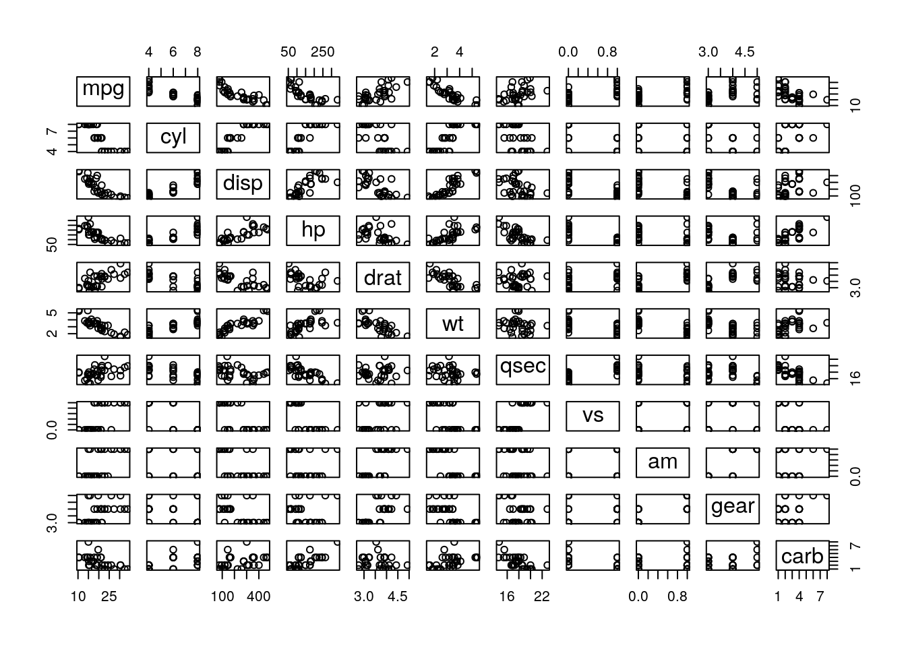
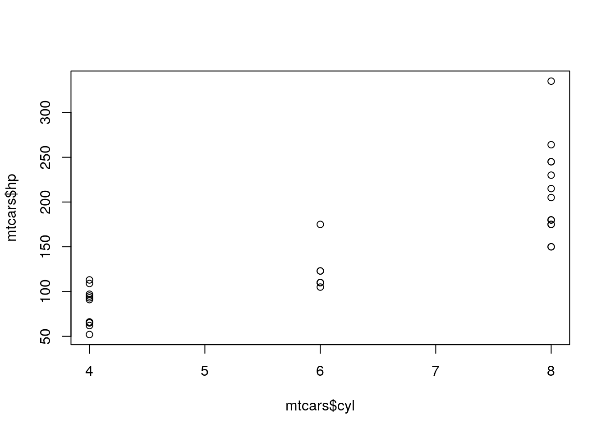
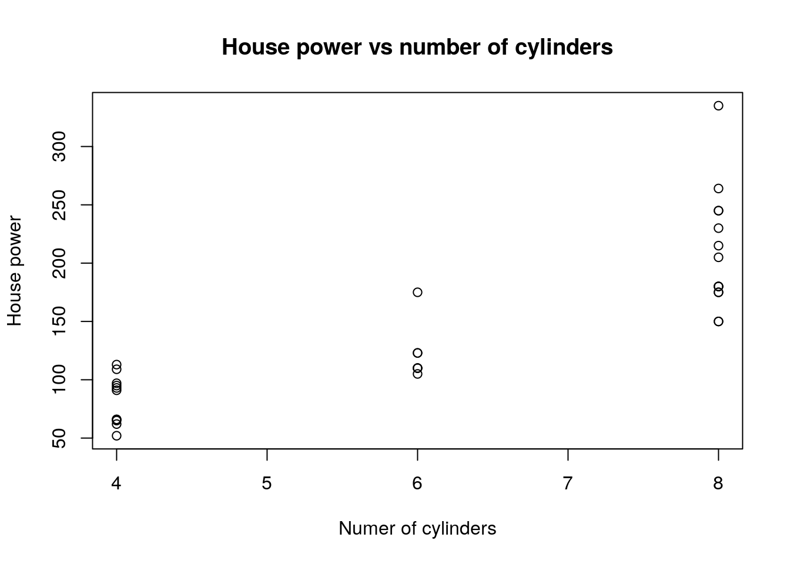

# The R chunk 2

## Working with code chunks

Let's continue our exploration of chunk options and now try a different example using `mtcars` dataset and learn a few more chunk options.


````
```{r}
summary(mtcars)
```
````


```r
summary(mtcars)
```

```
##       mpg             cyl             disp             hp       
##  Min.   :10.40   Min.   :4.000   Min.   : 71.1   Min.   : 52.0  
##  1st Qu.:15.43   1st Qu.:4.000   1st Qu.:120.8   1st Qu.: 96.5  
##  Median :19.20   Median :6.000   Median :196.3   Median :123.0  
##  Mean   :20.09   Mean   :6.188   Mean   :230.7   Mean   :146.7  
##  3rd Qu.:22.80   3rd Qu.:8.000   3rd Qu.:326.0   3rd Qu.:180.0  
##  Max.   :33.90   Max.   :8.000   Max.   :472.0   Max.   :335.0  
##       drat             wt             qsec             vs        
##  Min.   :2.760   Min.   :1.513   Min.   :14.50   Min.   :0.0000  
##  1st Qu.:3.080   1st Qu.:2.581   1st Qu.:16.89   1st Qu.:0.0000  
##  Median :3.695   Median :3.325   Median :17.71   Median :0.0000  
##  Mean   :3.597   Mean   :3.217   Mean   :17.85   Mean   :0.4375  
##  3rd Qu.:3.920   3rd Qu.:3.610   3rd Qu.:18.90   3rd Qu.:1.0000  
##  Max.   :4.930   Max.   :5.424   Max.   :22.90   Max.   :1.0000  
##        am              gear            carb      
##  Min.   :0.0000   Min.   :3.000   Min.   :1.000  
##  1st Qu.:0.0000   1st Qu.:3.000   1st Qu.:2.000  
##  Median :0.0000   Median :4.000   Median :2.000  
##  Mean   :0.4062   Mean   :3.688   Mean   :2.812  
##  3rd Qu.:1.0000   3rd Qu.:4.000   3rd Qu.:4.000  
##  Max.   :1.0000   Max.   :5.000   Max.   :8.000
```

**Remember** You can go between Rmarkdown and _console_, to check your code, at any time. You should see your code block is highlighted differently and you should see a green arrow at the right hand site of that block. Press the green arrow to get an output in the _console_. You can also use `ctrl+enter` to do the same with the keyboard short cut.


````
```{r}
plot(mtcars)
```
````


```r
plot(mtcars)
```



This is great, but a bit too much information, lets just focus on number of cylinders and hourse power.


````
```{r}
plot(mtcars$cyl, mtcars$hp)
```
````


```r
plot(mtcars$cyl, mtcars$hp)
```



We can add a bit more information to our plot, to make more self descriptive.


````
```{r}
plot(mtcars$cyl,
           mtcars$hp,
           main='House power vs number of cylinders',
           xlab = 'Numer of cylinders',
           ylab='House power')
```
````


```r
plot(mtcars$cyl,
     mtcars$hp,
     main='House power vs number of cylinders',
     xlab = 'Numer of cylinders',
     ylab='House power')
```


Here is a good example where we can hide our code from the viewer, since it isn't most interesting bit about this data. Let's turn `echo=FALSE` options for all our plots below.

Properly labelled plots are very informative, let's do that as well, starting with a title `main="Travelling speed vs Breaking distance"` and then labelling axis, x `xlab="Travelling speed (mhp)"` and y `ylab="Stopping distance (ft)"`




We are no longer seeing the code, rather just the figure. You can try `eval = FALSE` by yourself to see what happens.

## Figures related chunk options

- `fig.align` - left, right, center or default (left)
- `fig.height` - height specified in inches
- `fig.width` - width specified in inches
- `fig.cap` - string of text in quotes

Let me show you a how to resize the plot with `fig.height` and `fig.width` and then we are going to do a challenge.


````
```{r fig.height = 4, fig.width = 4}
plot(mtcars$cyl,
           mtcars$hp,
           main='House power vs number of cylinders',
           xlab = 'Numer of cylinders',
           ylab='House power')
```
````


```r
plot(mtcars$cyl,
     mtcars$hp,
     main='House power vs number of cylinders',
     xlab = 'Numer of cylinders',
     ylab='House power')
```


Let's try to make it very big, by trying to set height and width to 15 inches.


```r
plot(mtcars$cyl,
     mtcars$hp,
     main='House power vs number of cylinders',
     xlab = 'Numer of cylinders',
     ylab='House power')
```


Note that we are starting to hit "boundaries" of the documents. (want to talk about the fact that plot sits inside a `<div>` box)


## Challenge: code chunks {.exercise}

> 5 minutes

<details>
  <summary>
    1. Can you align figure to the right??
  </summary>
  `fig.align = 'right'`
</details>

<details>
  <summary>
    2. Align figure to the center and add figure legend
  </summary>
  `fig.align = 'center', fig.cap = 'Figure 1: blah'`
</details>

<details>
  <summary>
    3. Can you add some emphasis to figure legend, e.g make important parts bold or underlined?
  </summary>
  Remember that figure legend is just a string of text and any text can be marked
</details>

## More useful chunk options

I'm going to share a few more useful code chunks, some are cosmetic, some you may never use, but hey can be handy in making your document visually different.

- `prompt=FALSE` i.e mimic _consosle_
- `comment=` remove hash symbol at the front of the output
- `child=` path to another `Rmd` file
- `warning=FALSE`
- `messages=FALSE`

For this example I'm going to use simple `for` loop. We are going to use this variable `sentence <- c("Let", "the", "computer", "do", "the", "work")`


````
```{r}
sentence <- c('Let', 'the', 'computer', 'do', 'the', 'work')

for(word in sentence){
  print(word)
}
```
````


```r
sentence <- c("Let", "the", "computer", "do", "the", "work")

for(word in sentence){
  print(word)
}
```

```
## [1] "Let"
## [1] "the"
## [1] "computer"
## [1] "do"
## [1] "the"
## [1] "work"
```

Let's add `prompt=TRUE`


```r
> sentence <- c("Let", "the", "computer", "do", "the", "work")
> 
> for(word in sentence){
+   print(word)
+ }
```

```
## [1] "Let"
## [1] "the"
## [1] "computer"
## [1] "do"
## [1] "the"
## [1] "work"
```

Now let's add an external Rmd content into this file using `child` option


````
```{r child = 'child_chunk_example.Rmd'}
sentence <- c('Let', 'the', 'computer', 'do', 'the', 'work')

for(word in sentence){
  print(word)
}
```
````


***

> START of lonely file

### Stand alone Rmarkdown file


```r
a <- c(1, 1)
b <- c(1, 2)
cor(a, b)
```

```
## Warning in cor(a, b): the standard deviation is zero
```

```
## [1] NA
```

I'm a very lonely Rmarkdown file, can somebody include me in?

Cheer,

Rmd

> END of lonely file

***

## Challenge: more code chunks {.exercise}

> 5 minutes

<details>
  <summary>
    1. Add `library(tidyverse)` to get lots of messages and try to suppress them with chunk options
  </summary>
  `message = FALSE`
</details>

<details>
  <summary>
    2. In the example about `child_chunk_example.R` gives warning messages, can you suppress them from the output
  </summary>
  `message = FALSE`

## References

- [Section 2.6](https://bookdown.org/yihui/rmarkdown/r-code.html)
- [Pimp my RMD](https://holtzy.github.io/Pimp-my-rmd/)
