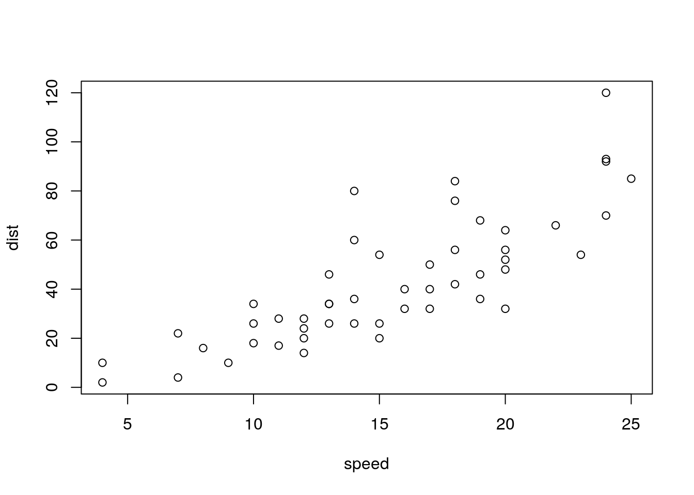

# Work in progress

##

Besides these html_document() options,

gitbook() has three other arguments:

- `split_by` argument specifies how you want to split the HTML output into multiple pages

    - `rmd`: use the base filenames of the input Rmd files to create the HTML filenames, e.g., generate chapter3.html for chapter3.Rmd.
    - `none`: do not split the HTML file (the book will be a single HTML file).
    - `chapter`: split the file by the first-level headers.
    - `section`: split the file by the second-level headers.
    - `chapter+number` and `section+number`: similar to chapter and section, but the files will be numbered.

- `split_bib`
- `config`

- `collapse`
    - `section`
    - `subsection`

      scroll_highlight: yes
      before: null

## check

A normal paragraph.

(ref:foo) A scatterplot of the data `cars` using **base** R graphics.


```r
plot(cars)  # a scatterplot
```

<div class="figure">

<p class="caption">(\#fig:unnamed-chunk-1)(ref:foo)</p>
</div>

##

In general think about fast turn around time and easi of editing.

this will remove numbering from that header


```
# Preface {-}
```

## YAML

WE are using yaml language define certain parameters that meant to do to different tools

some are designated for pandoc
other for bookdown package
other general rmarkdown/knitr settings

## LaTeX

$$f(k) = {n \choose k} p^{k} (1-p)^{n-k}$$

$$\begin{array}{ccc}
x_{11} & x_{12} & x_{13}\\
x_{21} & x_{22} & x_{23}
\end{array}$$

$$X = \begin{bmatrix}1 & x_{1}\\
1 & x_{2}\\
1 & x_{3}
\end{bmatrix}$$


## Tabbed sections

```
## Quarterly Results {.tabset}

### By Product

(tab content)

### By Region

(tab content)
```

```
## Quarterly Results {.tabset .tabset-fade .tabset-pills}
```

## Figure options via yaml

> This sounds interesting

ok, I've tested out and fig_height and width via yaml do the same thing as when passed through chunk options. I guess yaml allows global defition, although one can set chunk options globally too..

also need to cover `out.width = "70%"`

pretty good resource about image resizing https://sebastiansauer.github.io/figure_sizing_knitr/

## tables Rmarkdown

can't really describe at this stage where this is come from. it appears that it has links with pagedown and paged.js library

- `paged`

max.print	The number of rows to print.
rows.print	The number of rows to display.
cols.print	The number of columns to display.
cols.min.print	The minimum number of columns to display.
pages.print	The number of pages to display under page navigation.
paged.print	When set to FALSE turns off paged tables.
rownames.print	When set to FALSE turns off row names.
