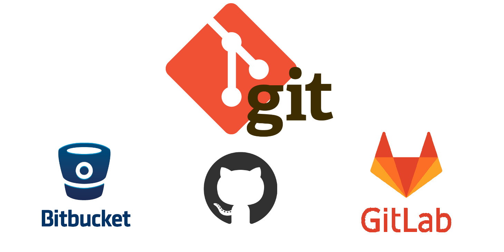
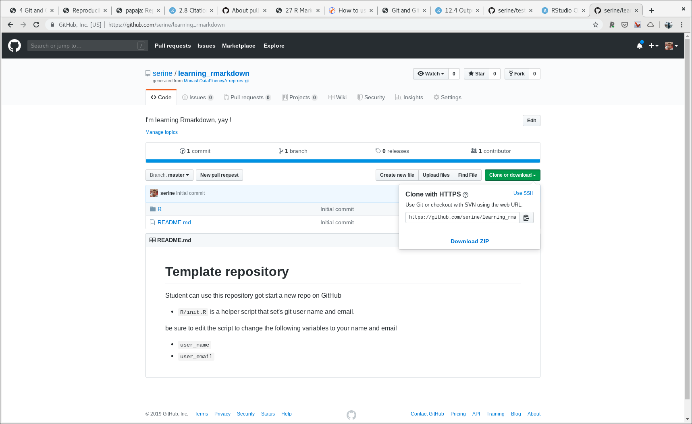
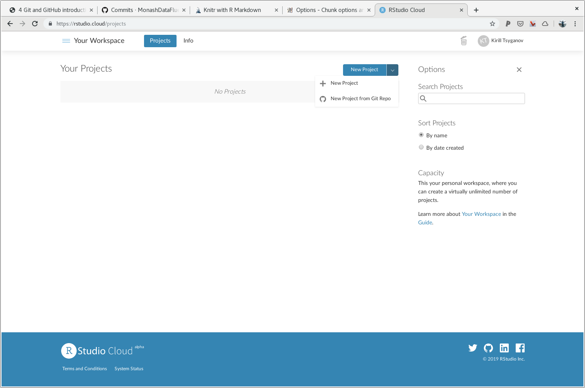
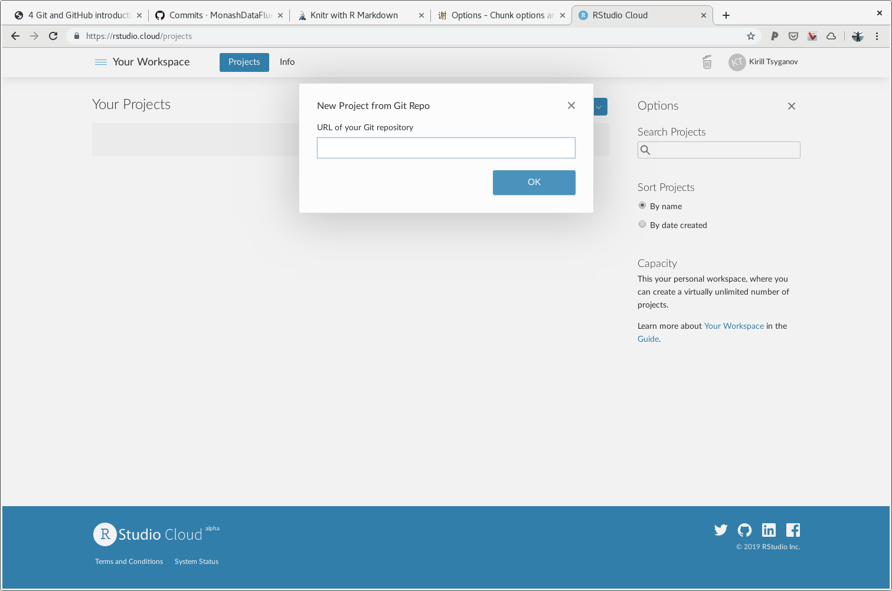
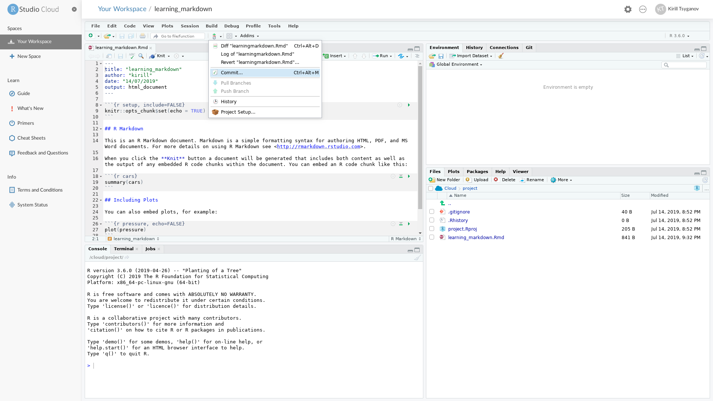

# (PART) Part {-}

# Git and GitHub introduction

> When you are rock climbing you want to set your anchors often
> How often will depend on your experience and desire not to fall
> Git commit like you are vertically hanging off 70 feet rock

I am going to break to you right at the start that (unfortunately) doing git and GitHub is like rock climbing, but nonetheless it has great benefits for your research and analysis including making it more visible, reproducible and potentially very collaborative.

[Git](https://git-scm.com/doc) is one of many tools, but it is very popular. Git was designed for **tracking versions** of software development - a.k.a version control tool. While it hasn't been strictly design with scientific research projects in mind we will happily re-purpose git to help us stay on top of our research projects. In the git world everything rotates around a git repository, which is a "special" folder. Inside that folder every file and folder is "tracked" for changes. Git repositories often are synonymous with project folder. In our case the RStudio project folder will be the same as the git folder. In other words we are going to tack all changes in our project.
Note that the two, git and RStudio project, are independent of each other and you can use one or another or both.

Below I am trying to illustrate of the differences between do-it-yourself (DIY) version control system, which may be great, and git version control. DIY version control systems are great with two caveats:

- no one else will understand it
- the future you will forget the awesome schema that you have invented

(ref:git1) This is an example of git version control vs DIY versioning via filesystem

```{r echo=F, out.width="100%", fig.align="left", fig.cap='(ref:git1)'}
knitr::include_graphics("figures/git_vs_filesystem.png")
```

From now onwards we are going to use the `git` version control tool. We are also going to use GitHub for storing our files remotely. GitHub isn't the only place that people can use with git for file storage and sharing. Below an illustration of some other common place one can choose to store they git repositories a.k.a projects.

(ref:github1) https://www.geekboots.com/story/what-is-the-difference-between-bitbucket-github-and-gitlab

```{r echo=F, out.width="100%", fig.align="left", fig.cap = '(ref:github1)'}

```

In theory one can also store `git` repositories in google drive or dropbox or other similar places, however neither of those places have been optimised for `git` version control repositories. We will talk shortly about advantages that GitHub brings to the project.

For this workshop we are going to use GitHub, mainly because is very popular and it has a lot of useful features.

## Quick summary

Git and GitHub will help you:

- organise our directory structure
- create "milestones" a.k.a `git commits`
- make apparent which parts of the projects (files) are important
- share your work (e.g GitHub)
- collaborate at the global scale

## Github setup

There are a couple of different ways you can start a project and initiate git repository - git tracking. We are going to start with GitHub first approach. An alternative approach discussed in [appendix section](#git-and-github). I hope that everyone had already created [GitHub](https://github.com/) account.
We are going to make new github repository from [this template](https://github.com/MonashDataFluency/r-rep-res-git).

- head to your web-browser (chorme or firefox)
- sign into github [github.com](https://github.com)
- head over to this repository [https://github.com/MonashDataFluency/r-rep-res-git](https://github.com/MonashDataFluency/r-rep-res-git)
- click "Use this template"

You should see a screen like this.

```{r echo = F, out.width = "100%", fig.align = "left"}
knitr::include_graphics("figures/github6.png")
```

Let's populate all of the fields with the following information.

- Repository name "learning_rmarkdown"
- Description "I'm learning Rmarkdown, yay!"
- click "Create repository from template"

Note that a description of the repository is optional, but it is a good  idea to write a brief sentence there. This is mainly to message (and remind) yourself and the public about the intentions of this project. More in depth description should also be added to the [README.md](#git-and-github) file, but we are going to skip this step in our workshop.

Once we have our GitHub repository we need to find a link or an address (URL) of this repository so that we can take copy of it a.k.a `git clone`. Cloning or coping is a routine step in any git + github workflow. In this case we are cloning our repository from the GitHub to our working computer, in our case [rstudio.cloud](https://rstudio.cloud). You can take as many copies of your repository as you like, just remember that at some point in futures you will need to merge different copies, if you like to incorporate the changes into main line.
By cloning our repository we are establishing connection between [rstudio.cloud](https://rstudio.cloud) and GitHub such that we can with little effort we can copy our work, that is file from [rstudio.cloud](https://rstudio.cloud) to GitHub. This gives us few things:

- a backed up copy of our code and analysis
- remote access from other computers and places
- visibility and shareability

This is how a typical URL looks for github repository looks like

```
https://github.com/kirill/learing_rmarkdown.git
```

There are at least three components in that url

- `https://github.com/` the place i.e the name of the website
- `kirill/` username
- `learing_rmarkdown.git` repository name (project name). Note that `.git` bit at the end can be omitted

You can get this url, but either looking at the address bar of your browser or there is a little drop down menu on the right hand site. Copy that url to your clipboard, we will need it shortly.

```{r echo = F, out.width = "100%", fig.align = "left"}

```

In general when we create a new github repository we automatically initialising git for version tracking. This may sound confusing, but this is mainly because we are starting with GitHub first. You can have git repository on your local computer and not have to store it anywhere else remotely. There are more details in [appendix](#git-and-github) how to start with git first.
Remember that GitHub is just a place where we are storing our git repository, that gives us a few extras mentioned above.

## RStudio setup

Now that we have setted up our github repository and found our address for cloning the repo. We need to copy our repository to [rstudio.cloud](https://rstudio.cloud). For that follow these steps:

- go to [rstudio.cloud](https://rstudio.cloud)
- look for "New Project" button
- from drop-down menu to select "New Project from Git Repo"
- paste your GitHub repository url and press "ok"

```{r echo = F, out.width = "100%", fig.align = "left"}


```

This will take a few seconds to initialise. After you can see Rstudio again be sure to name your project using a window at the top of the screen.

## Git intro

Git is a command line tool however you don't have to learn command line just yet. There are a [few git clients available](https://happygitwithr.com/git-client.html) - graphical user interface (GUI) tool / applications that we can use instead of learning command line. We are going to use RStudio which has good git support and therefore Rstudio will be our git client. One rather important note about git clients, most (all) clients will "simply" form a git commands as you would type it out and execute on command line. This means a couple of things:

1. one can use mixture of clients and command line without any issues. For example if one needs more complicated git command one could run it on the command-line.
2. if you need to do a more complicated git kung fu you might only find solution for command line and then it'll be up to you to figure out how to work it into your client

An interesting note about command line git usage noted in [Happy Git with R book](https://happygitwithr.com/git-client.html); One might think that git via cli is "better", however it is more important to get the work done and have it version controlled rather then fight with the cli. Do take the simplest and quickest path to get your work version controlled. No one will care which client you are using in the end.

Tips:

- no spaces in file names (this goes beyond git)
- no git repositories inside an existing git repository

## Git setup

If you are staring with git for very first time you need to a couple of configuration. You will need to add your name and email address to git configuration file. This is because git is all about version tracking and collaboration. It will not only track your changes and assign your name + email signature to every "milestones" (git commits), but it will be able to easily differentiate between a "milestone" from a different person, because there will be a different name + email signature.
You only have to do this one per computer, so if you don't change your computer all that often you'll forget that you have ever done this before, but this is okay since git will happily remind you about that with this friendly message.

```{r echo=F, out.width="100%", fig.align="left"}
knitr::include_graphics("figures/git2.png")
```

Sadly RStudio doesn't provide smooth way of adding name + email to your git configuration file. There are perhaps several good reasons as to why. It is likely that because this is relatively "one off" thing, RStudio has it as a low priority feature. I have confidence that it will come in later additions.

For this workshop we are going to run a short script that came with our templated repository, `R/init.R`. Open this script in R studio to examine the content. Double click on `R/init.R` file in file browser panel to open it in text editor panel. There are four commands there, first two are must run, third simply a check of the config file to make sure it all worked and the 4th command is a convenience setting.

At the top of the file change `user_name` and `user_email` to your name and email and run the script by pressing green button "run" at the top of that panel or using keyboard shortcut `ctrl+shift+enter`

It felt like a lot of setting up, but this is mainly because you are not familiar with git and doing it for the first time. In general those steps are "natural" part of your workflow, very quick and not noticeable.

## Git and GitHub workflow

### First commit

Let's make our first commit, use drop down menu as indicated on the image below to select `commit` option

```{r echo=F, out.width="100%", fig.align="left"}

```
You should see a new window poped up

```{r echo=F, out.width="100%", fig.align="left"}
knitr::include_graphics("figures/git1.png")
```

Then we are going to add three files

- `.gitignore`
- `project.Rproj`
- `learning_markdown.Rmd`


Write a commit message and press commit. And this is how happy git commit looks like

```{r echo=F, out.width="100%", fig.align="left"}
knitr::include_graphics("figures/git3.png")
```

The commit message is rather important. Remember that commit message is:

- a message to a future you
- a message to your supervisor
- a message to all other external people

Those commit messages are means of communications e.g

- "fixed figure 1 legend"
- "added new paragraph to chapter 1"
- "I bloody hate this project delete everything, starting from scratch"

Good thing is, as long as you "tracking" your deletes you can always go back to them and check what you have deleted and revert some of those changes back when needed. However in this workshop we won't be covering much of that.

Also note that commit message don't have to long, and can be as short as one work - "update2", but at the same time well written commit message will help you and other.

http://r-pkgs.had.co.nz/git.html#commit-best-practices

## Good thing about GitHub

- PR (pull request)
- gitissues place to talk about issues related to a project
- stars acknowledgement
- watch interested in updates on a projects

<!--
TODO in future need to make an annotated images of all those github buttons mentione above
-->

collaborators and update dates/commits as a proxy of how active the project is. also do check which files typically being changed. Also mention the fact that it is very explicit when the project was started (initiated) how much work has gone into it (commits history) and roughly time frame and intervals of work

in simple workflow and collaborations git merge will work just fine. git will happily merge two different branches i.e all files in one location with all files in the other location if no two file conflict

## Which files to commit?

This section will be extended in the future release, but I highly recommend reading this article, specifically [section 10: Which files to commit from here](https://peerj.com/preprints/3159/)

