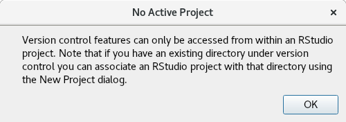
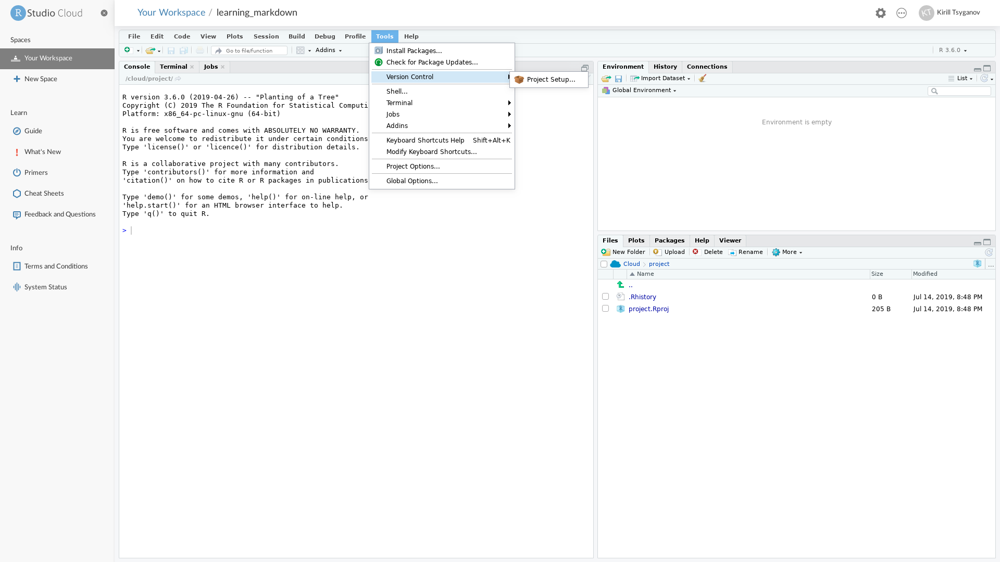
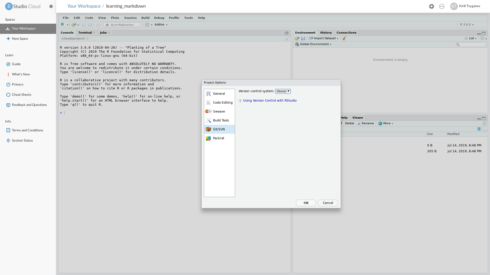

# Git introduction

> When you are rock climbing you want to set your anchors often
> How often will depend on your experience and desire not to fall
> Git commit like your vertically handing off 70 feet rock

[Git](https://git-scm.com/doc) is one of many tool, but very popular, that was design for **tracking versions** of software development - a.k.a version control tool. While it hasn't been strickly design with scientific research projects in mind we will happily repurpose git to help us stay on top of our research projects. Git will help us:

- organise our directory structure
- create "milestones" a.k.a `git commits`
- make apparent which parts of the projects (files) are important
- git will also help us to share our work
- and last but not least git will help us collaborate

```{r echo=F, out.width="100%", fig.align="left", fig.cap="This is an example of git version cotrol vs DIY versioning via filesystem"}
knitr::include_graphics("figures/git_vs_filesystem.png")
```

Git is a command line tool however you don't have to learn command line just yet. There are a [few git clients available](https://happygitwithr.com/git-client.html) - graphical user interface (GUI) tool / applications that we can use instead of learning command line. We are going to use RStudio which has good git support and therefore Rstudio will be our git client. One rather important note about git clients, most (all) clients will "simply" form a git commands as you would type it out and execute on command line. This means a couple of things:

1. one can use mixture of clients and command line without any issues. For example if one needs more complicated git command one could run it on the command-line.
2. if you need to do a more complicated git kung fu you might only find solution for command line and then it'll be up to you to figure out how to work it into your client

An interesting note about command line git usage noted in [Happy Git with R book](https://happygitwithr.com/git-client.html); One might think that git via cli is "better", however it is more important to get the work done and have it version controlled rather then fight with the cli. Do take the simplest and quickest path to get your work version controlled. No one will care which client you are using in the end.

## git no nos

- no spaces in file names (this goes beyond git)
- no git repositories inside an existing git repository

## Starting with git

In Rstudio you can only start working with git when you have an existing Rproject directory

```{r echo=F, out.width="100%", fig.align="left"}

```

### Configuring git

You will most certainly forget this step, because you only need to do it once per computer (or new installation of git). Git will remind if you haven't done these steps.
These are our very first step in being organise and ready for future collaboration. We need to let git know our name and email address, which will get stored in configuration file.

Unfortunately RStudio doesn't have support for setting up config. It was probably not worth implementing given that you only really do it once. We will have to use terminal (command line) just this once.

Let's open up a terminal and run a couple of `git` commands

Tools -> Terminal -> New Terminal

```
git config --global user.name kirill
git config --global user.name "kirill.tsyganov@monash.edu"
```

One can then double check that all was set correctly bu running this command.

```
git config --global --list
```

```{r echo=F, out.width="100%", fig.align="left"}
knitr::include_graphics("figures/git2.png")
```

### Intiating git repository

In git jargon repository is simply your working folder (folders sometimes also called directories). In our case

`Rproject folder == Rproject directory == git repository == git repo`

Let's initate git repository

Tools -> Version Control -> Project Setup -> Git/SVN

```{r echo=F, out.width="100%", fig.align="left"}

```

And select from the drop down options "Version control system" Git

```{r echo=F, out.width="100%", fig.align="left"}

```

The command line equivalent is navigating to your project directory and running `git init`

### First commit

Let's make our first commit, use drop down menu as indicated on the image below to select `commit` option

```{r echo=F, out.width="100%", fig.align="left"}
knitr::include_graphics("figures/git4.png")
```
You should see a new window poped up

```{r echo=F, out.width="100%", fig.align="left"}
knitr::include_graphics("figures/git1.png")
```

Then we are going to add three files

- `.gitignore`
- `project.Rproj`
- `learning_markdown.Rmd`


Write a commit message and press commit. And this is how happy git commit looks like

```{r echo=F, out.width="100%", fig.align="left"}
knitr::include_graphics("figures/git3.png")
```

The commit message is rather important. Remember that commit message is:

- a message to a future you
- a message to your supervisor
- a message to all other external people

Those commit messages are means of communications e.g

- "fixed figure 1 legend"
- "added new paragraph to chapter 1"
- "I bloody hate this project delete everything, starting from scratch"

Good thing is, as long as you "tracking" your deletes you can always go back to them and check what you have deleted and revert some of those changes back when needed. However in this workshop we won't be covering much of that.

Also note that commit message don't have to long, and can be as short as one work - "update2", but at the same time well written commit message will help you and other.

http://r-pkgs.had.co.nz/git.html#commit-best-practices

## Which files to commit?

This section will be extended in the future release, but I highly recommend reading this article, specifically [section 10: Which files to commit from here](https://peerj.com/preprints/3159/)
