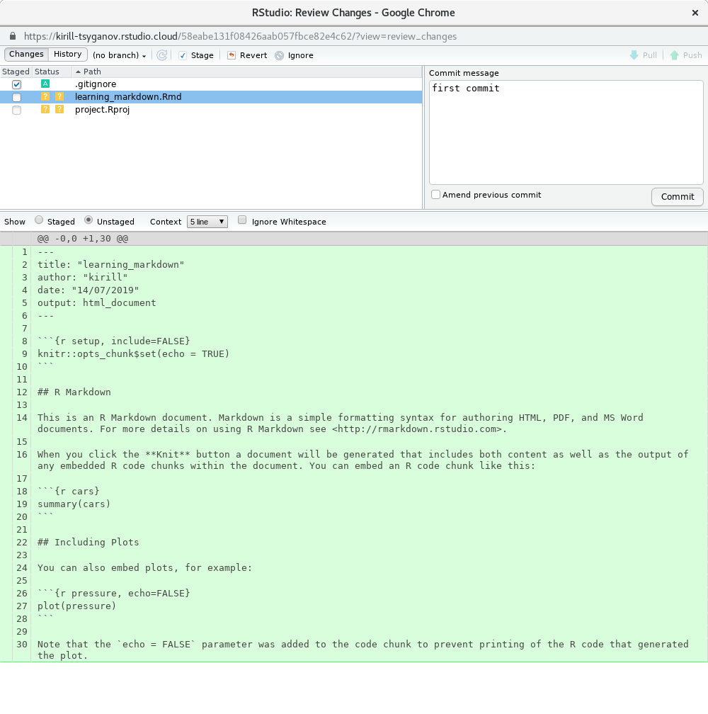

# Git, GitHub and RStudio Rproj file {-}

Git, GitHub and RStudio projects are three independent things; a tool, a place and an anchor respectively. It is however very hard to make a clear distinction between all three. Just know that all three together will help you with keeping on top of your project, minimise content and data loss and will make your work naturally more collaborative.

# Git (part one)

In the part one section of the book we will show you how to work with git on your local compute, without any regard to the external (remote) place such as GitHub. [In part two](#git-two) we will show you how to work with external (remote) repositories hosted at GitHub

## Introduction

[Git](https://git-scm.com/doc) is a version control tool, one of many tools, but it is very popular. Git was designed for **tracking versions** of software development, but it has been re-purpose for doing general tracking of text and data i.e scientific research.

Below is an illustration of the differences between do-it-yourself (DIY) version control system, and git version control. DIY version control systems are great with two caveats:

- no one else will understand it
- the future you will forget the awesome schema that you have invented

(ref:git-vs-filesystem) This is an example of git version control vs DIY versioning via filesystem

```{r git-vs-filesystem, echo=F, out.width="100%", fig.align="left", fig.cap='(ref:git-vs-filesystem)'}
knitr::include_graphics("figures/git_vs_filesystem.png")
```

We are not going to dwell on git long, there are much better resources for that, like [Happy Git and GitHub for the useR](https://happygitwithr.com/). But we will learn a handful of git commands just enough for us to track and share our research.

## Git init {#git-init}

Let's initiate new git repository, which is a lingo for marking our current folder **special**. From now on everything in that folder will be tracked by git. **BUT** we still have to actively save (commit) changes.

```
Tools
 └── Version Control
           └── Project setup
           
Version control system: git
```

Alternatively execute the following code in R console and re-launch RStudio project

```{r eval = F}
system("git init")
```

Once that's done, you should see new `Git` tab appearing in "Environment, History ..." pane

--- That was unusual ...

## Git commit

Let's click on that new "Git" tab and select a couple of file and then click "commit" button.

1. Select these files:

- `learning.Rmd`
- `learning.html`
- `presenting.Rmd`
- `presenting.html`

A new dialog should pop up, you should see this window \@ref(fig:git1) 

(ref:git1) RStudio pop up dialog for git commit and other git related work

```{r git1, echo=F, out.width="100%", fig.align="left", fig.cap='(ref:git1)'}

```

2. Write down a commit message (free form, but keep it informative)

Let's write the following text in the commit message box and press "commit"

```markdown
saving my first Rmarkdown document
```
(ref:git2) RStudio pop up dialog for git commit and other git related work with commit message

```{r git2, echo=F, out.width="100%", fig.align="left", fig.cap='(ref:git2)'}
knitr::include_graphics("figures/git2.png")
```

--- happy days!

## Git username and useremail

When you are using git for very first time on a new compute you will need to set up your username and email. Typically this is one off operation and almost always forgot about. But git will always remind you about that with the following message \@ref(fig:git3)

(ref:git3) RStudio pop up dialog showing additional step needs doing before using git 

```{r git3, echo=F, out.width="100%", fig.align="left", fig.cap='(ref:git3)'}
knitr::include_graphics("figures/git3.png")
```

Let's execute the following two commands in R console pane, as suggested by the message. Note if you don't use `--global` flag, then every new git repository will need those two commands (personal preference really).

```{r eval = F}
system("git config --global user.name kirill")
```

```{r eval = F}
system("git config --global user.email tskiril@gmail.com")
```

Let's switch back to our commit, pop up, window close that messagea and click commit again.

--- oops, forgot about that 
