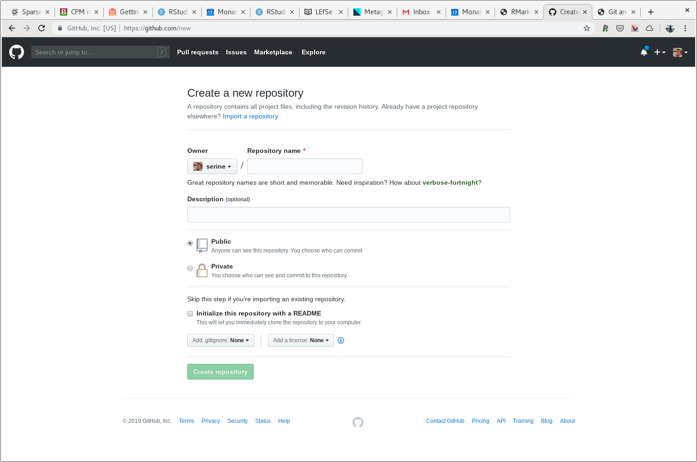
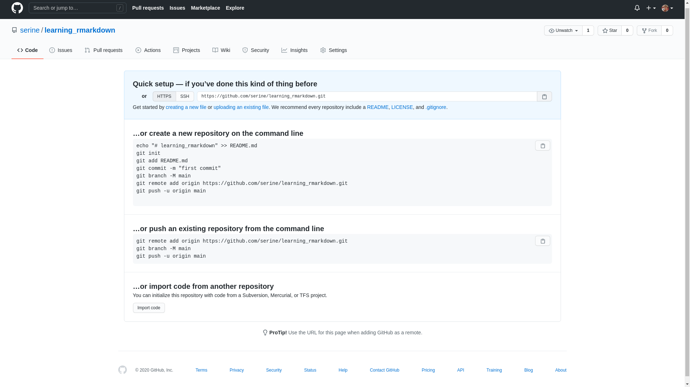

# GitHub (part one) {#github-one}

In this part of the book we will introduce [GitHub](https://github.com), which is one of several places you can host - store and display your project files. GitHub can only work with git tool, hence the name. However there are other vendors that are a more tools agnostic

## Introduction

GitHub has been around for more than 10 years. The original, and the most dominant still, purpose is store software source code in public. By putting your code on display gave at least two important benefits:

1. "free" and easy code oversight: sanity and bugs checks
2. ease of collaboration: take a copy and play with it, PR (pull request) later

GitHub platform has become indispensable to the software industry. 

There is some lingo that is associated with GitHub, the most central one is "repository" or "repo" for short. That simply refer to a folder (a.k.a directory) on your computer that had git initiated as per [Git init](#git-init) section. Your GitHub account can have any any number of repos, each one of them is a distinct project. 

## New repository

> Prerequisite: Have to register for a GitHub account first at [github.com](https://github.com)

Let's begin by making a new repository. Go to [github.com](https://github.com) and look for plus sign (New repository). Interface may change time to time, but look at the top  right hand corner. Once you've clicked on "New repository" button, you should see the following window \@ref(fig:github1)

(ref:github1) New repository dialog at github.com

```{r github1, echo=F, out.width="100%", fig.align="left", fig.cap='(ref:github1)'}

```

Let's give our new repository a name and a short description. Type the following text and press green button on the bottom of the screen "Create repository"

```markdown
learning_rmarkdown
```

```markdown
I'm learning Rmarkdown, Git and GitHub
```

Notes:

- Don't select any other options, keep repository public 
- It is a good practice **NOT** to use spaces in your repository name. Here we are using an underscore instead.

(ref:github2) New repository dialog at github.com, with text

```{r github2, echo=F, out.width="100%", fig.align="left", fig.cap='(ref:github2)'}
knitr::include_graphics("figures/github2.png")
```

## Repository address (git remote`)

Once you've clicked on "New repository" button you should see the following, new window appearing in front of your \@ref(fig:github3) (provided you didn't select any of the additional files, like README file)

Copy on your clipboard URL that is presented to you at the top of the page. For me the url looks the following

```markdown
https://github.com/serine/learning_markdown.git
```

It will look very similar in your case, except the username part. The following if your typical URL structure for github repositories. Note that square brackets is a convention meaning "substituted with", they don't need to be included in your actual URL

```markdown
https://github.com/[USERNAME]/[REPOSITORY_NAME]
```

(ref:github3) Secondary window, once new repository was created at github.com

```{r github3, echo=F, out.width="100%", fig.align="left", fig.cap='(ref:github3)'}

```

## Linking Git with GitHub {#git-github-link}

Now that you have successfully created new repository at GitHub we need to link (add) address of our github repository to our local git folder (also called repository). This simply means letting git tool know where to deposit (push) our code for storage and display.

Let's switch back to the RStudio client, where we have been doing work and execute the following command in R console. Note you will need to **substitute** your own URL (github repository address) below.

```{r enval = F}
system("git remote add origin https://github.com/serine/learning_rmarkdown")
```

Now you have linked your local git repository with remote one (a.k.a github repository) you can start synchronising your content between two locations. In git lingo **pushing and pulling**. Let's talk more about that in the [next section](#git-two)
