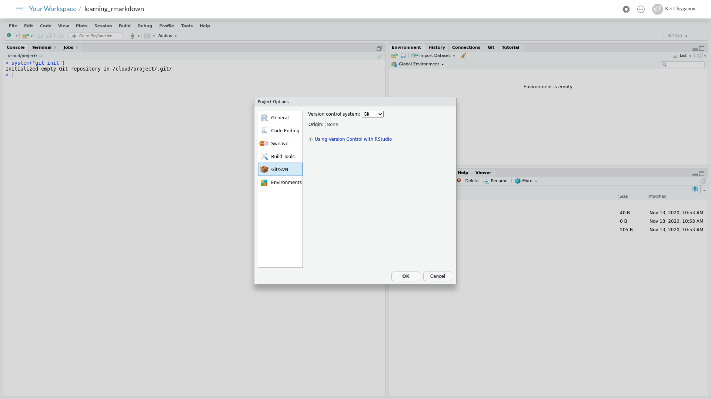

# Git (part two) {#git-two}

In this section we will learn a typical workflow of **pulling** and **pushing** our files and data between local git and remote github repositories. In the [next section](#github-two) we will explore some of the GitHub platform specific features that will helps us with sharing our research.

## Introduction

As was discussed in [previous section](#git-github-link) we need to link our local git repository with the remote one at the github platform.

For some odd reason you can't simply copy and paste github remote address into relevant section of the setup window using RStudio client. In the figure \@ref(fig:rstudio1) below, input box "Origin" is grayed out. I have tried and I cannot find a way to update that via RStudio client interface.

Steps were described in [git init](#git-init) section of the book on how to get to that dialog popup. 

(ref:rstudio1) Version control dialog

```{r rstudio1, echo=F, out.width="100%", fig.align="left", fig.cap='(ref:rstudio1)'}

```

## Linking Git with GitHub (repeat)

Let's add our github remote address to git via R console command. **Remember to substitute** your own URL (github repository address) into the command below. We also need to relaunch our R project, but closing and reopening RStudio project. This is another, minor, peculiarity of working with git via RStudio client

_If you are using [rstudio.cloud](https://rstudio.cloud), relaunch the project via a drop down menu top right hand side corner, three little dots next to the cog symbol, select "Relaunch Project"_

```{r enval = F}
system("git remote add origin https://github.com/serine/learning_rmarkdown")
```

Now if you navigate to that the version control dialog you should see "Origin" input box has been populated with your address, as per the figure \@ref(fig:rstudio2)

(ref:rstudio2) Version control dialog

```{r rstudio2, echo=F, out.width="100%", fig.align="left", fig.cap='(ref:rstudio2)'}
knitr::include_graphics("figures/rstudio2.png")
```

## "origin" lingo in git

Origin in the context of git means remote location for your git repository. It is a key (short hand representation) for our URL for when we are pushing and pulling code between local and remote repositories. We don't have to use "origin" key name, we can use any other names, for example `project_x_github_repo`. The only caveat to that RStudio client won't be able to understand that keyword.  

If you would like to try this out, run the following commands in the R console

```{r eval = F}
system("git remote add project_x_github_repo https://github.com/serine/learning_rmarkdown")
```

```{r eval = F}
system("git remote -v"
```

## git push

We have already learned how to checkpoint our files with git commit in the [previous section](#git-commit). Let's now synchronise our local repository with remote github one by pressing on green arrow up button "push" in the "Git" tab. We will be prompted to enter our github username and the password. 

Let's switch to GitHub window in our web browser, update the webpage to see our code appearing on the remote GitHub platform.

--- marvelous ! 

## git pull

`git pull` is a complementary command to `git push`, which is actually does two things `git fetch` - bring remote changes to your local repository and `git merge` synchronise  files between local and remote copies. 

We will stop our git journey here. If you would like to learn more about git and github look into the resource mentioned in the [opening of this part](#git-opening-section).

--- sad :'(
