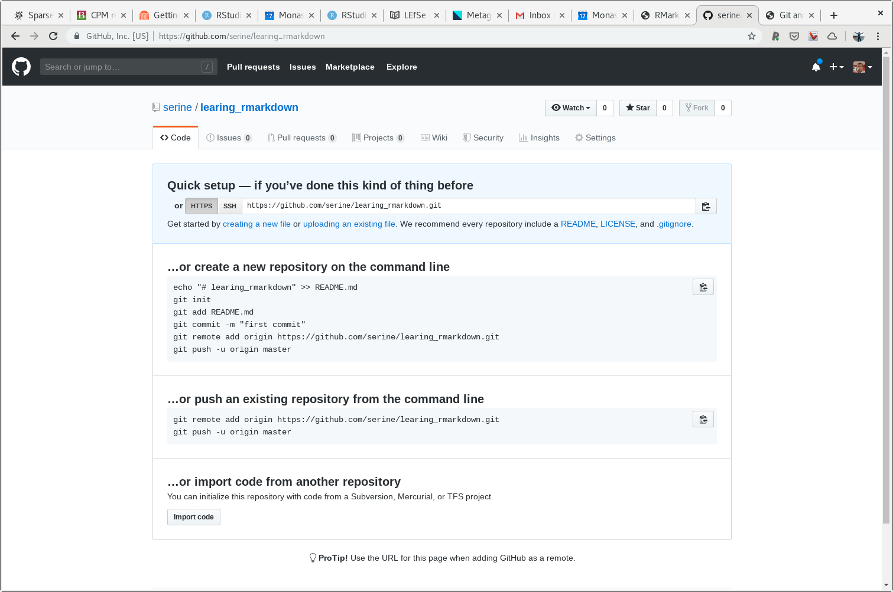
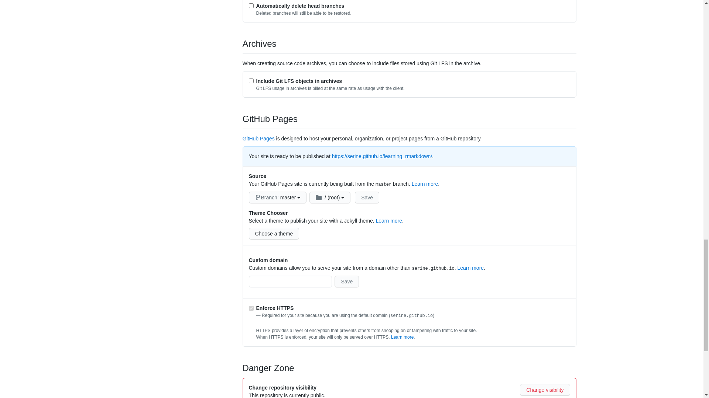
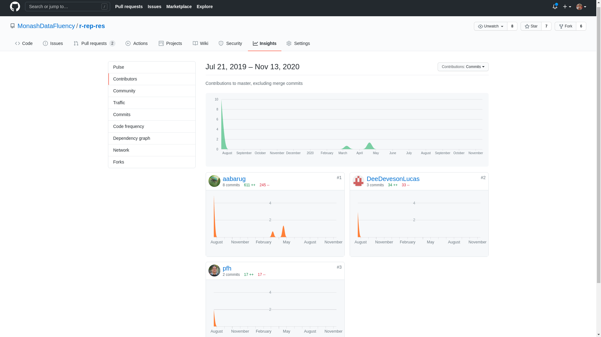
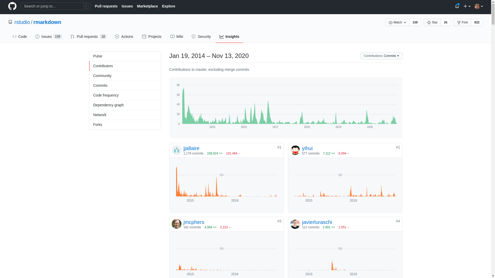

# GitHub (part two) {#github-two}

In this section of the book we will introduce to you a few GitHub platform specific features that greatly enhance the git tool and provide incredible visibility and transparency to your project.  

## README.md 

`README` is a gold standard file that holds some essential information about the directory  (project) that you found it in. The content of the file is free form, but we would say a bear minimum, at least in relation to the project we have in mind (research code and data, type repositories), `README` file should typically contain; short message about motivation for the project, installation instructions and usage as well as some examples. 

You might have realised that `.md` stands for markdown, as oppose to `.Rmd` - Rmarkdown. GitHub will seek this file `README.md` exactly, case sensitive, and it will turn it into a front page of your GitHub repository. We will leave this as home work for you todo later.

> **Home work:**
> Create file called README.md, you can use the following command. Include, level one header with the project name and three level two headers coresponding to the section; motivations, usage and examples. Then save the file, git commit and git push. You should now have a front cover to your GitHub repository

```{r eval=FALSE}
file.edit("README.md")
```

--- clever

## GitHub pages (gh-pages)

Another useful feature of the GitHub platform is GitHub pages, which allows us to host HTML files. Hosting means making files accessible to the greater internet, sometimes with ability to setup allowed list of users (i.e username and password sign in page). GitHub platform provides **open access hosting** only, to everyone on internet. 

Let's enable that feature for our GitHub repository by going to the settings tab, at the top of our repository page and scrolling down to the "GitHub Pages" section, see image \@ref(fig:github4). Select from the drop down menu "master" and click "save" button, you should see the following image \@ref(fig:github5). Copy and Paste URL that appeared at the top of GitHub Pages section, once you've clicked save (you might have to scroll back down to it), you should see the following image \@ref(fig:github6)

(ref:github4) GitHub Pages section at the GitHub website

```{r github4, echo=F, out.width="100%", fig.align="left", fig.cap='(ref:github4)'}
knitr::include_graphics("figures/github4.png")
```

(ref:github5) GitHub Pages section at the GitHub website, with "master" branch selected

```{r github5, echo=F, out.width="100%", fig.align="left", fig.cap='(ref:github5)'}

```

(ref:github6) GitHub Pages section at the GitHub website, with URL displayed

```{r github6, echo=F, out.width="100%", fig.align="left", fig.cap='(ref:github6)'}

```

Once you've set GitHub Pages you can access your HTML file using that URL with additional text pointing to your desired file, for example if I would like to see `learning.html` file I would use the following url [https://serine.github.io/learning_rmarkdown/learning.html](https://serine.github.io/learning_rmarkdown/learning.html)

General schema for GitHub Pages URL as follows

```markdown
https://[USERNAME].github.io/[REPOSITORY_NAMEl]/[FILENAME].html
```

--- fair dinkum !

## Visible contributions 

(ref:github-contrib1) Reproducible Research in R (this book) GitHub page, insight tab showing contribution from other users

```{r github-contrib1, echo=F, out.width="100%", fig.align="left", fig.cap='(ref:github-contrib1)'}

```

(ref:github-contrib2) Rmarkdown R package GitHub page, insight tab showing contribution from other users

```{r github-contrib2, echo=F, out.width="100%", fig.align="left", fig.cap='(ref:github-contrib2)'}

```

It is hard to easily see a number of contributors to rmarkdown R package project, however number of "forks" is one reasonable indicator for how many people are attempting to collaborate.

Compare:

- community contributions
- stars
- forks
- issue
- pull request

