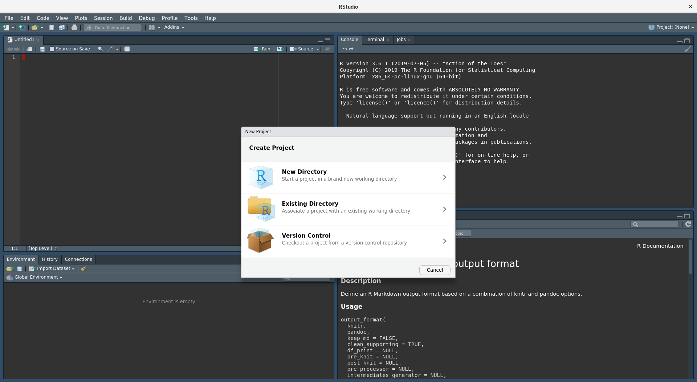

# RStudio project (`*.Rproj` file)

## Introdunction

## Being clear

That exercise hopefully will make you appreciate the importance of the keeping your project organised. Note that this example was "easy" since I kept all relevant files in one directory, sometimes files can be scattered around file system (very bad idea)

- [presentation](presentations/root_proj_dir/pres.html)

```{r echo=F, out.width="100%", fig.align="left", fig.cap='(ref:rproj)'}
knitr::include_graphics("figures/rstudio-rproj2.png")
```

## R project

> What is R project? It is a simple anchor for your project, everything should rotate around that anchor a.k.a `.Rproj` file.

Typically you'll set up a new directory (folder) for your new project, which from the moment of creation becomes "the root project directory" for that new project. All other files that are related to that specific project should be contained with in root project directory. RStudio provides nice and simple mechanism to anchor yourself to the root project folder by initiating `.Rproj` file inside it. You should not have more that one `.Rproj` file per project, meaning no children directories of the root project directory can have another/additional `.Rproj` file. There is really no need for more than one `.Rproj` file.

`.Rproj` file help with:

- setting working directory `setwd()` to the right location i.e your root project directory
- load previous code and R object
- together with RStudio, `.Rproj` help to store and retract your work without loss

RStudio will also initialise and use `.Rproj.user` directory, you don't need to worry about what it is for. RStudio simply uses that for your project tracking and caching

Remember that `.Rproj` file is a simply plain text / configuration file

## RStudio initialisation

Let's open [rstudio.cloud](https://rstudio.cloud) instance. The cloud instance automatically initialises `.Rproj` file, defaulting to `project.Rproj` name. Typically RStudio will use the name of your root project directory for `.Rproj` file e.g

```
mkdir projectA -> projectA.Rproj
```

you can rename it later into any other name, it doesn't really matter, but it is probably best to keep it as is

Outside of [rstudio.cloud](https://rstudio.clou) you will have to remember to initialise `.Rproj` yourself via the menu, at the top right hand conner of the RStudio IDE, you should see this pop-up window

```{r echo=F, out.width="100%", fig.align="left", fig.cap='(ref:rproj)'}

```

Each option has specific use case, but they are all very similar

- New project will create new directory and set all the file
- Existing directory as name suggests will simply initiate `.Rproj` file
- Version control, will do all of the above as well as initialise tracking of that directory, which we will explore soon

## Closer look at `.Rproj` file

Before we can look at `.Rproj` file I need to segue into tiny bit of command line (and we will have to expand on this later as well)

RStudio is very nice and it comes with inbuilt terminal, in short terminal is how we can interact with computer using special command hence command line. Typical point of confusion is what is the difference between "console" and "terminal" in RStudio, as those are two tabs located right next to each other. Look for a "prompt" R has `>` and Command line has `$`. The prompt is waits for user input a.k.a commands which is than interpreter and Rstudio/computer acts accordingly. R prompt (`>`) can only understand R command and Linux terminal (often times referred as BASH) `$` can only understand it's own command.

We are not going to learn any more about command line other than a handful of commands. (Un)fortunately git is so advance that we will need to use command line (sometimes). Since we are using command line, I want to also show you what the `.Rproj` file really is and how to work with it manually if you wish.

Let's drop into terminal - i.e click on terminal tab in our Rstudio interface and type

```
file project.Rproj
```

This tells us that the file is ASCII which simply means it is a plain text file. This is great since we can use any text editor tool to view and manipulate the file, if we wish

Now run a second command, `cat`, which is **concatenate files and print on the standard output (screen)**, to look at the content of the file

```
cat project.Rproj
```

We can see a bunch of key/value pairs, not surprising - typical config file.

The other "sneaky" way to look at the file, this is of course if you know what the file type is, which we have found out, is to try to import it as some table. Let's press File -> Import Dataset -> From text (base) and than select our `project.Rproj` file. Note the command that R going to run in the console inorder to import the file.

## Challenge: Rpoject 2 {.exercise}

> 3 minutes

<details>
  <summary>
    1. What other configuration keys are available for `.Rpoj` file?
  </summary>
  [Look for publically available `.Rproj` files if you can't find any docs](https://github.com/tidyverse/tidyverse/blob/master/tidyverse.Rproj)
</details>

## Customising our `.Rproj` file

Let's add tiny bit of customisation,

lets change these keys

- `SaveWorkspace: No`
- `RunWeaver: knitr`

Rstudio prevents us from open `.Rproj` file using inbuilt text editor, via File -> open file -> `project.Rproj`. Rstudio wants us to use inbuilt GUI, I guess to ensure that we set all the key/values correctly. I just want you to know that at a more advance level you will probably setting those keys manually via a text editor.

## Should I git commit my `.Rproj` file?

[**yes, definitely !**](https://community.rstudio.com/t/should-rproj-files-be-added-to-gitignore/1269/4)

## References

- [Rstudio](https://support.rstudio.com/hc/en-us/articles/200526207-Using-Projects)
