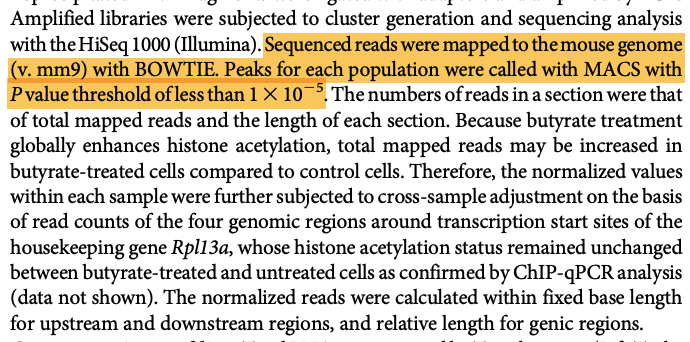
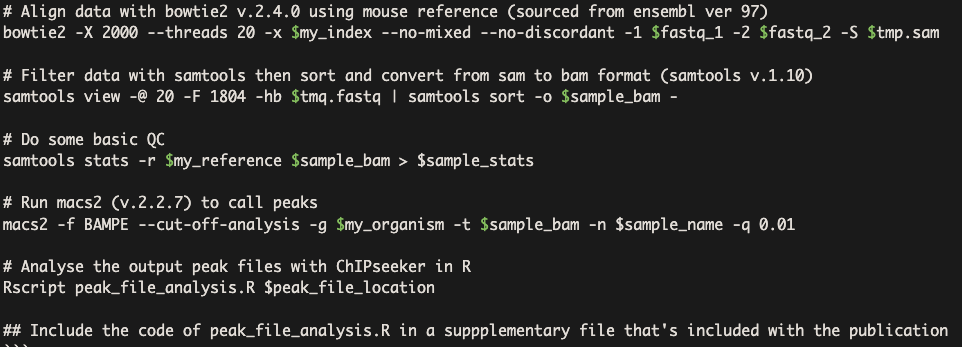
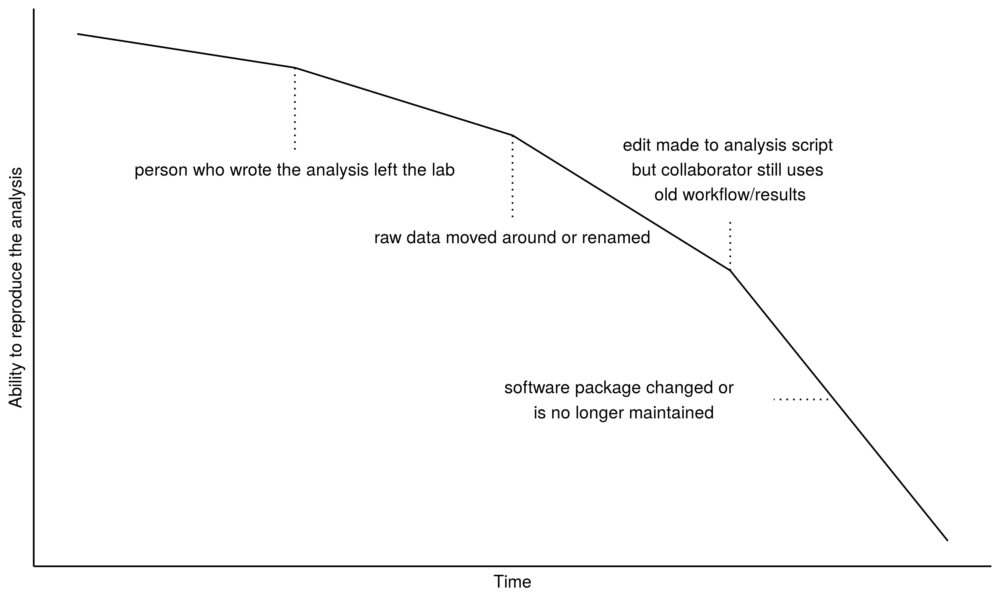
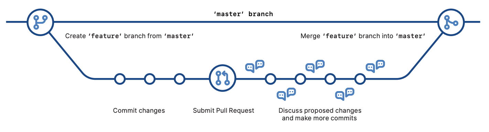

```{r setup, include=FALSE}
knitr::opts_chunk$set(echo = FALSE, fig.align="center")
```

# Workshop Objectives

* introduction to writing and communicating research using R Markdown
* use knitr, rmarkdown and bookdown R packages to build various document types including PDF, HTML and DOCX
* work with git version control tool
* create reproducible and “backed up” analysis via remote repositories (e.g github)

What We Aren't Learning:

* How to code with R itself

---

# What Are We Learning

R + R Markdown = create documents that can contain both code and formatted text

Git + Git Hub = how to version control your analysis 

R + RStudio + R Markdown happens to be an ideal environment to work in but can also support other programming languages such as Python, Bash, SQL, etc.

Git/Git Hub and R Markdown/R Studio are two seperate ecosystems that work together quite nicely for data science purposes for project management and communication

---

# Reproducibility Crisis

```{r, out.width="70%", out.height="70%"}
knitr::include_graphics("images/reprod.png")
```

---

# Reproducibility

Can the results of a paper be attained by a different team using the same methods* described by that paper?

--

*this depends on how well the methods are documented

--

Depending on field, your mileage may vary greatly on the level of documentation

--

e.g:

```{r, out.width="65%", out.height="65%", fig.cap="A Bioinformatics Example"}

```

---

## A Bioinformatics Example

`Sequenced reads were mapped to the mouse genome (v. mm9) with BOWTIE.`

`Peaks for each population were called with MACS with P value threshold of less than 1e-05.`


Oh cool, they used BOWTIE and MACS for their analysis...

--

...or did they? This paper was published in **2013**

--

MACS2 was released in *2011*

--

Bowtie2 was published in *2012*

--

Both Bowtie2 and MACS2 are the recommended versions to use - my gut feeling here is that they definitely used MACS2 - and may or may not have used Bowtie2

--

From Bowtie 2's manual: `Bowtie 2 is not a “drop-in” replacement for Bowtie 1.`

---

## A Bioinformatics Example

```{r, fig.cap="Me (way too often) vs a methods section"}
knitr::include_graphics("images/hark_meme.jpg")
```

---

## A Bioinformatics Example

More useful:

```{r}

```

---

### Discussion `r anicon::faa("question", animate="bounce", speed = "slow")`

What makes an analysis reproducible?

---

## Will The Analysis Stand Up Over Time

```{r, out.width="70%", out.height="70%"}

```

---

## Some Tips For Reproducible Analysis 

* Document what you've done with your data in code (harder to capture mouse-clicks)
* Record the software versions used for the analysis
* Keep data & analysis in one place
* Track changes to your analysis with version control so you have a complete history of the analysis

```{r, out.width="50%", out.width="50%"}
knitr::include_graphics("images/version_control_1.png")
```

---
## Version Control with Git

Version Control - system for tracking changes in a file

Git - version control tool originally designed for software development, meant for collaborating on large pieces of software between programmers

The data analysis field has repurposed git for project management and collaboration

```{r}

```

---

## Pro/Cons of Git

.pull-left[
Pros:

* free
* track changes between files
* complete history of your analysis
* easy to share and distribute files and collaborate with other people
* With GitHub - works well with R Markdown and easy to create websites to share and display results
]
.pull-right[
Cons: 

* can be non-intuitive, especially for beginners
* when things go wrong in Git, can be very confusing to fix it
* does not track changes for binary files e.g Word documents, Excel spreadsheets
]

```{r, out.width="20%", out.width="20%"}
knitr::include_graphics("images/git_logo.png")
```

---

background-image: url(images/r_logo.png)
background-position: 50% 50%
class: center, bottom

---

## R

Programming language for statistical computing and graphics

- Free legally & continous active development
- Low risk of inadvertent data loss/mutation:
  * By design, R requires you to load your data in, what you do with the data is then written in code (R language)
- Collaborative: share your data and analysis 

```{r fig.cap="Well developed ecosystem of tools for data analysis"}
knitr::include_graphics("images/analysis_cycle.png")
```

---

### Why not use an R script for communication?

```
# Start of my analysis
# Define the variables I'm going to use
z <- c(1:10)
x <- c(11:20)
v <- sample(1:500, 10)
# Let's examine the relationship between z and x
plot(z, x)
# It's interesting to see that z and x....
```

The # symbol is used to write notes in a R script and it's not really ideal for note-taking or including other things such as images, hyperlinks and tables into the script.
---


background-image: url(images/rmarkdown_packages.png)


---

## What is R Markdown

The marriage between Markdown, a lightweight markup language and R, a programming language for statistics

R Markdown is both an R package & a plain text file-type that allows you to embed R code chunks + plain text notes & images. 

A single R Markdown file can both save and execute code as well as generate high quality reports.

Everytime you produce an output document from an R Markdown file, it will re-excute all of your code by default, ensuring the results are up-to-date (and if you've broken your code, it will fail to execute)

```{r out.width="80%", out.width="80%"}
knitr::include_graphics("images/rmarkdownflow.png")
```

---

## R Markdown

One file, so many outputs

```{r out.width="40%", out.width="40%", fig.align="center"}
knitr::include_graphics("images/rmarkdownoutputformats.png")
```

The more places (files) an analysis is spread across, the more work it is to keep all of it accurate and up-to-date.

R Markdown allows you to focus on generating content & doing your analysis without (hopefully) spending too much time fighting your document itself

---

## About Today's Workshop

* Today, we'll focus on R Markdown, tomorrow on Git and GitHub
* Ask questions throughout this workshop!
* Course material is freely available online - come back to it anytime
* Attend this workshop again 
* MBP & Data Fluency have a help session every Friday at 3pm
* The workshop Slack channel will be archived after the workshop, however stay involved by asking questions on the general and coding-help channels on the Data Fluency Slack channels

---

## Set-up

If you haven't already, go to RStudio Cloud and create an account

Do you have a GitHub account created?