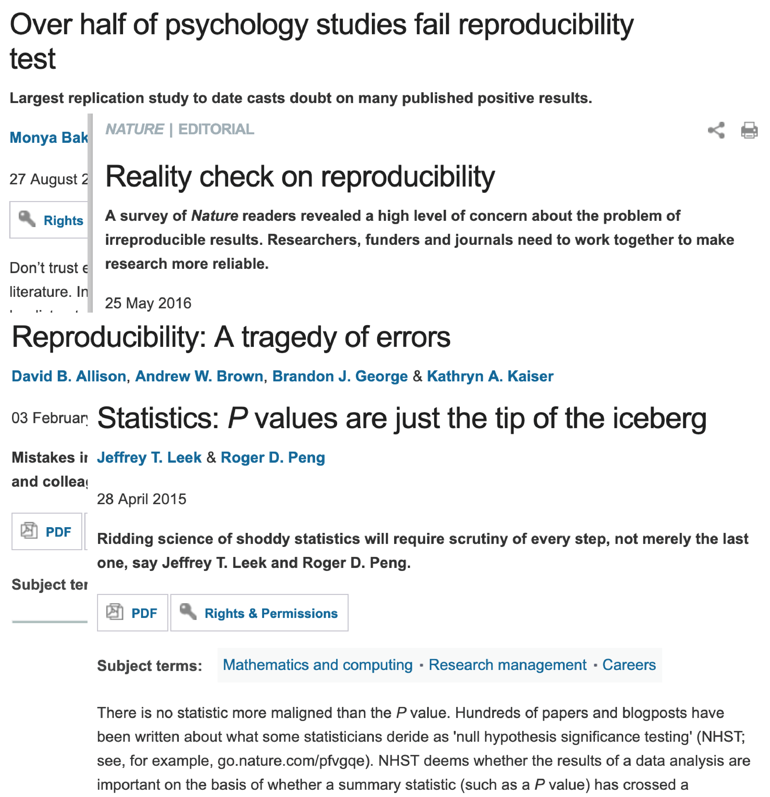
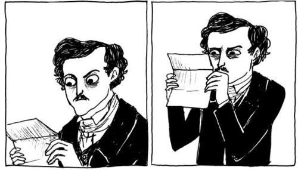
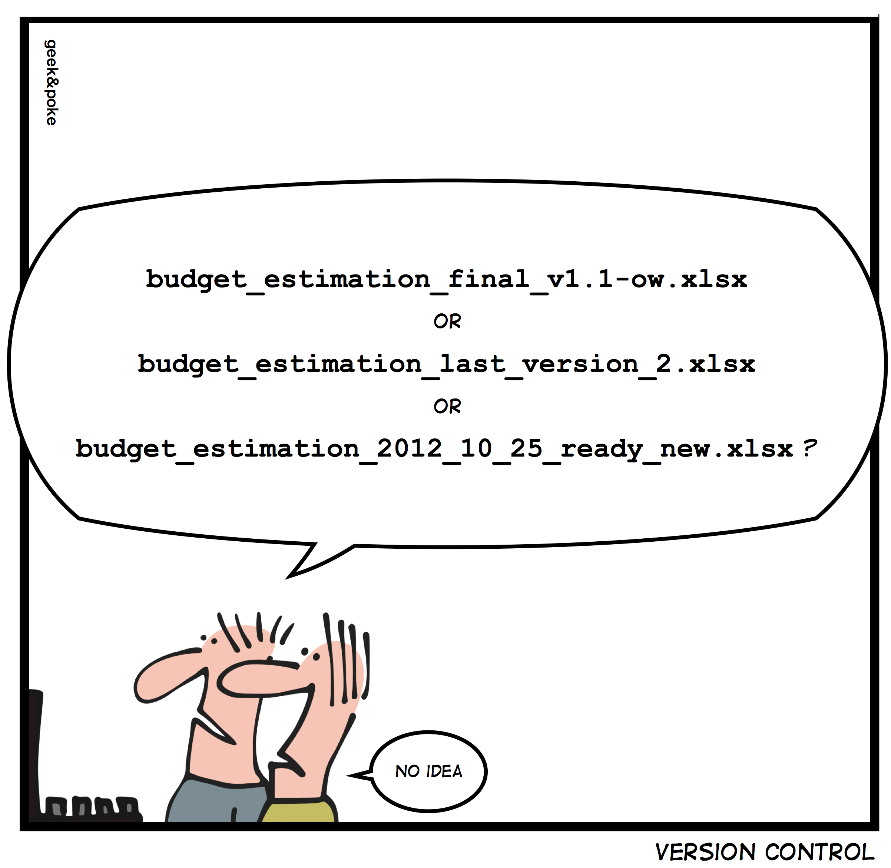
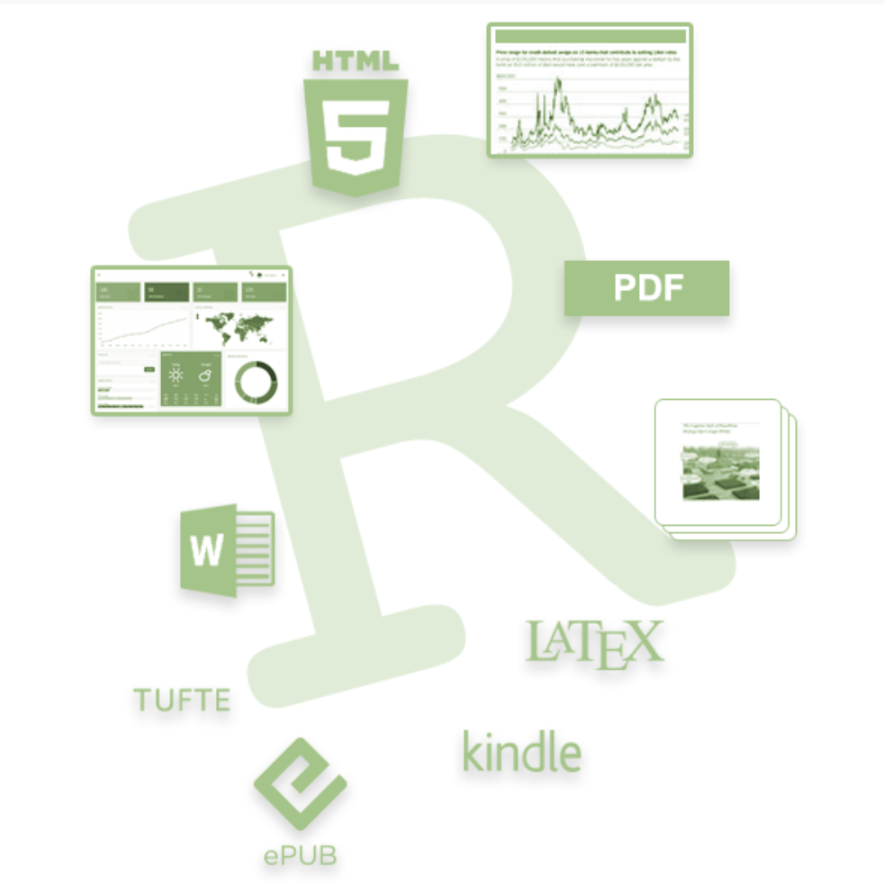
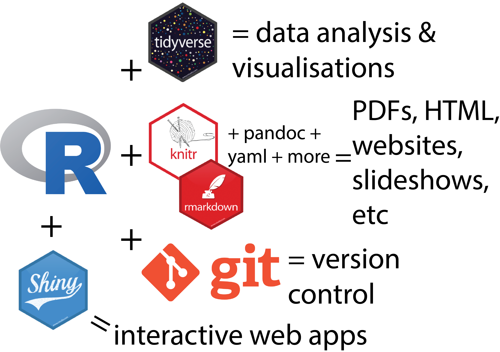
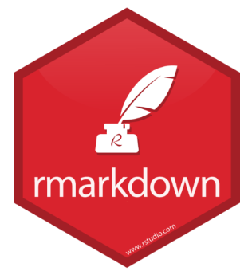

```{r setup, include=FALSE}
knitr::opts_chunk$set(echo = FALSE)
```

## Today's Objectives

* use knitr, rmarkdown and bookdown R packages to build various document types including PDF, HTML and DOCX
* work with git version control tool
* create reproducible and “backed up” analysis via remote repositories (e.g github)

What We Aren't Learning:

* How to code with R itself

## If We Aren't Learning R, What Are We Learning?

R has a rich ecosystem of packages that allow you to create reproducible documents and workflows 

We're going to be teaching you how to use both internal and external software packages in combination together to write these documents and workflows. 

R + RStudio + Rmarkdown happens to be an ideal environment to work in but can also support other programming languages such as Python, Bash, SQL, etc.

We're really only scratching the surface of what R/RStudio/Rmarkdown can do

## Reproducibility Crisis

<div align="center">

</div>

## An Innocent Question

Researcher: can you please perform the analysis in this [paper...](paper/furusawa_2013.pdf)

## Reconstructing A Computational Analysis

`Sequenced reads were mapped to the mouse genome (v. mm9) with BOWTIE. Peaks for each population were called with MACS with P value threshold of less than 1e-05.`

Oh cool, they used BOWTIE and MACS for their analysis...

> - ...or did they? This paper was published in 2013.

> - MACS2 was released in 2011
> - Bowtie2 was published in 2012

> - From Bowtie2's manual: `Bowtie 2 is not a “drop-in” replacement for Bowtie 1. Bowtie 2’s command-line arguments and genome index format are both different from Bowtie 1’s.`

## Reconstructing A Computational Analysis

How did they run [BOWTIE?](http://bowtie-bio.sourceforge.net/bowtie2/manual.shtml)

> - `bowtie2 -X 2000 --threads 20 -x \${indName} --no-mixed --no-discordant -1 ${reads[0]} -2 ${reads[1]} -S tmp.sam 2>${sample_ID}_bowtie2.log`

> - Between running Bowtie and MACS, there are number of other tools I would use for quality control steps and filtering steps that I would carry out.

> - This paper skips over what for me would be a full workflow script with multiple lines of code and 3-4 different tools that can all be optimised in terms of parameters - here, it is described in two sentences only.

---

Researcher: can you please perform the analysis in this paper?

---

Researcher: can you please perform the analysis in this paper?

<div align="center">

</div>

> - I'm often performing an educated reconstruction of what I think went on in an paper.

> - It really shouldn't be this way, code is text-based - why aren't code analyses being included in publications?*

> - *Your experience may greatly vary depending on your field

## Things To Think About

How do you future-proof an analysis so that you can come back to it years and:

A) Rerun it and get the same original answer

B) Understand why you did x, y and z in the analysis

C) How easy is it to repeat the analysis on new data?*

> - *This is verging on writing an R package and putting it out for the community's use but honestly - I'd be pretty happy if people just included the code that did the analysis in their paper rather than doing software development

--- 

How do you future-proof an analysis so that you can come back to it years given that:

* Future You isn't going to remember every step of an analysis: document your analysis
* Software packages: updates, deprecation - will the tools you used now be available later?*
* How easy is it to share your code/data for someone else** to run and duplicate the analysis

> - *This is actually pretty important and we don't cover it in this workshop - R has the Packrat package to sorta address this but I'm not sure it's a complete solution
> - **Someone else is often you two years from now
> - Basically, try to be kind to future you and others


## Tips For Reproducible Analysis 

* Document what you've done with your data in code
* Maintain software versions used for the analysis
* Keep data & analysis in one place
* Track changes to your analysis with version control

<div align="center">

</div>

## Open Reproducible Science

[Paper](https://www.nature.com/articles/s41467-018-07771-0) & [analysis](https://github.com/dbrg77/plate_scATAC-seq)

* Software versions are documented
* Code included that generated the figures in publication
* Data is available

---

Anyway, back to R & this workshop

## Why Use R/Rmarkdown

R - programming language for statistical computing and graphics

- Free legally & continous active development
- Low risk of inadvertent data loss/mutation:
  * By design, R requires you to load your data in, what you do with the data is then written in code (R language)
- Collaborative: share your data and analysis 

<div align="center">

</div>

## Why Use R/Rmarkdown

[Well developed ecosystem](https://www.rstudio.com/products/rpackages/) of software packages that expands base R for data analysis, project management, visualisation, document generation, etc

<div align="center">

</div>

## R Ecosystem

A small subset...

<div align="center">

</div>


## What is Rmarkdown

The marriage between Markdown, a lightweight markup language and R, a programming language for statistics

Rmarkdown is both an R package & a plain text file-type that allows you to embed R code chunks + plain text notes & images. 

<div align="center">

</div>

---

Why not use an R script for analysis?

```
# Start of my analysis
# Define the variables I'm going to use
z <- c(1:10)
x <- c(11:20)
v <- sample(1:500, 10)
# Let's examine the relationship between z and x
plot(z, x)
# It's interesting to see that z and x....
```

The # symbol is used to write notes in a R script and it's not really ideal for note-taking or including other things such as images, hyperlinks and tables into the script.

## Rmarkdown

One file, so many [outputs](https://rmarkdown.rstudio.com/formats.html)

The more places (files) an analysis is spread across, the more work it is to keep all of it accurate and up-to-date.

Rmarkdown allows you to focus on generating content & doing your analysis without (hopefully) spending too much time fighting your document itself

## About Today's Workshop

* Sticky notes are for help!
* Ask questions throughout this workshop!
* Course material is freely available online - come back to it anytime
* Attend this workshop again 
* MBP & Data Fluency have a help session every Friday at Clayton 3pm
* Data Fluency has a talk on the last Friday of the month
* Data Fleuncy has a Slack channel where you can ask questions online - please join it 